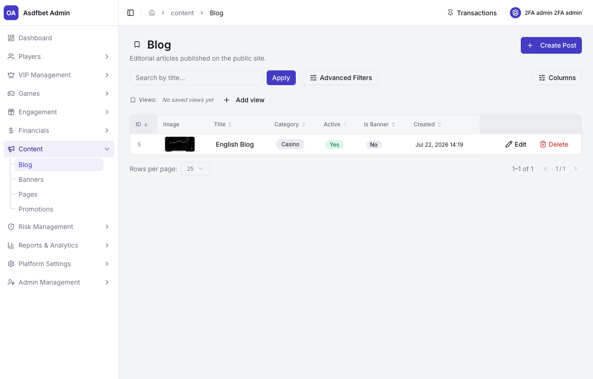
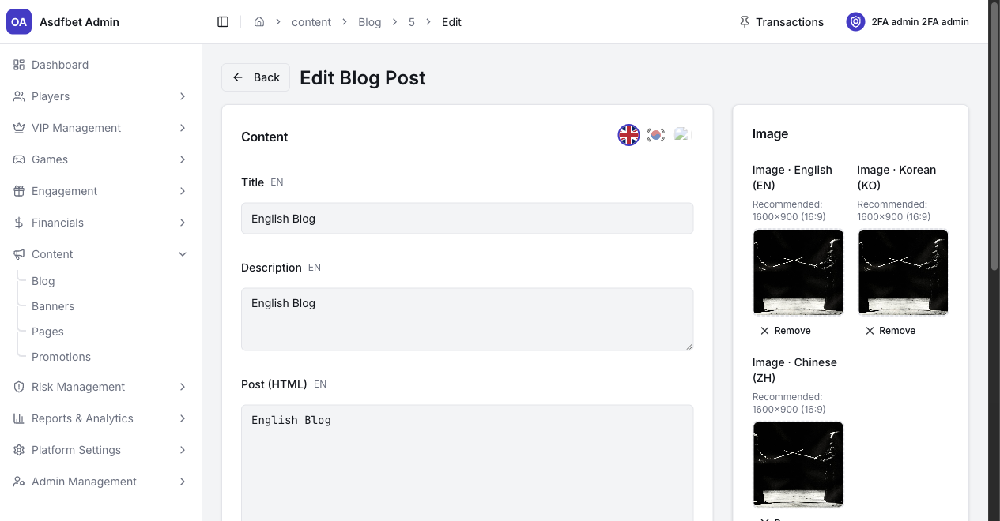
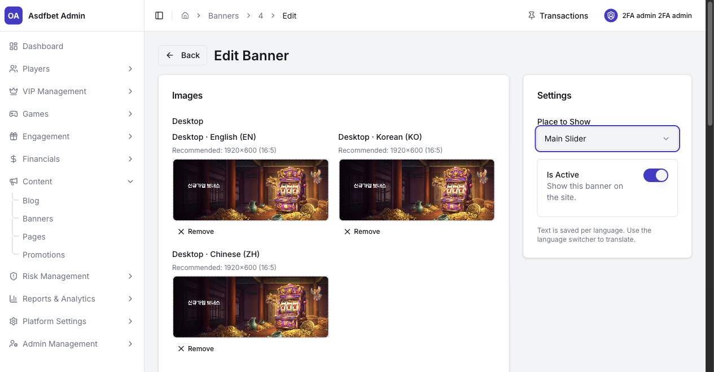
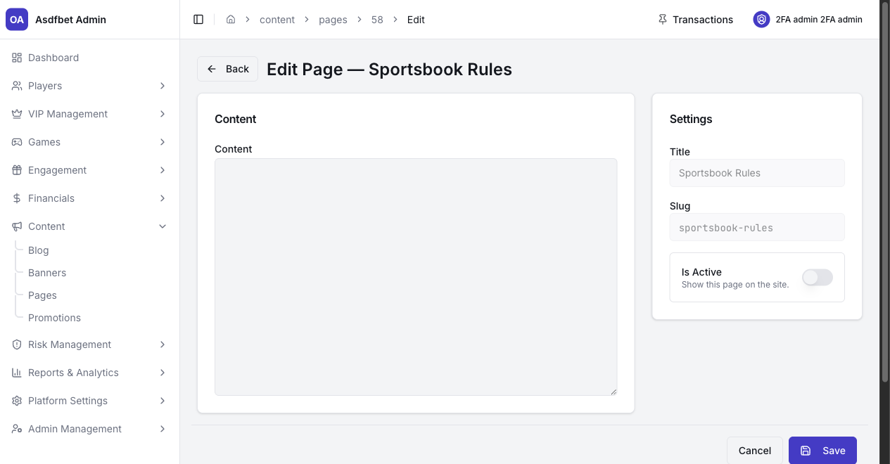
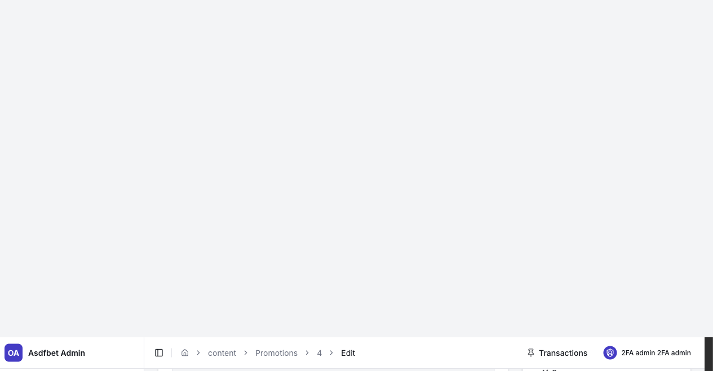

# Content

## Content

Use Content to manage player-facing copy, media, and campaign pages.

[Open the complete Content manual](documentation.md#7-content)

### Blog

Create and edit editorial posts with localized titles, descriptions, body content, images, categories, and active status.

### Banners

Upload separate desktop and mobile images for each supported language. Choose whether the banner appears in the Main Slider or In House Games.

### Pages

Manage legal and informational pages, including Terms, Privacy, AML Policy, and licenses. Each language uses a separate record.

Changing a page slug changes its public URL. Confirm legal approval before publishing compliance content.

### Promotions

Create time-boxed promotional landing pages with localized content, images, start and end dates, and active status.

Confirm translation, scheduling, and active status before publishing. Check active promotions after their end date.

[Previous: Financials](financials.md) · [Next: Risk Management](risk-management.md)
