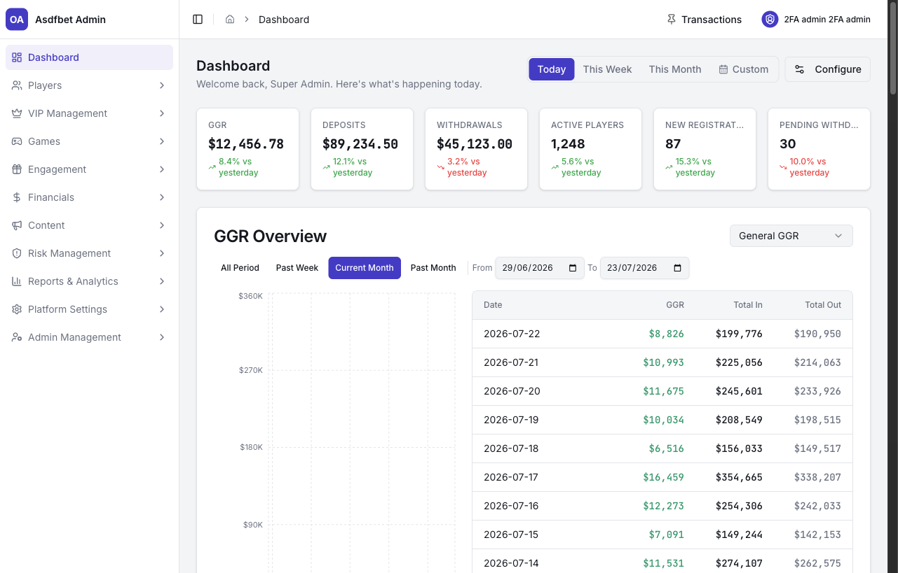

# Dashboard

## Dashboard

Use Dashboard to assess revenue, cash flow, player activity, and operational queues.

### Start here

Check **Pending Withdrawals** first. Then review GGR, deposits, withdrawals, and active players.

Use each chart's local date range before comparing results.

[Read the Dashboard reference](documentation.md#1-dashboard-overview)

[Next: Players Management](players-management.md)
