# Complete reference

> **Scope note:** This guide's primary focus is business logic, workflows, data fields, and administrative capabilities rather than visual layout or colors, since the UI design may change independently of the underlying functionality. Reference screenshots are included alongside the written descriptions throughout (stored under `images/`) for use in the published GitBook.

**Source system:** `admin.asdfbet.com` **Audience:** Platform administrators, support/compliance staff, and operations teams.

***

## Table of Contents

1. [Dashboard Overview](dashboard.md)
2. [Players Management](players-management.md)
   * [2.1 All Players](documentation.md#21-all-players)
   * [2.2 KYC Queue](documentation.md#22-kyc-queue)
   * [2.3 Archived Players](documentation.md#23-archived-players)
3. [VIP Management](player-management/vip-management.md)
   * [3.1 VIP Players](documentation.md#31-vip-players)
   * [3.2 VIP Player Profile — Tab-by-Tab Purpose](documentation.md#32-vip-player-profile--tab-by-tab-purpose)
4. [Games](/broken/pages/U9QNXxSsRjiqvmS7xV0E)
   * [4.1 All Games](documentation.md#41-all-games)
   * [4.2 Game Analytics](documentation.md#42-game-analytics)
   * [4.3 Providers](documentation.md#43-providers)
   * [4.4 Categories](documentation.md#44-categories)
   * [4.5 Game Blocks](documentation.md#45-game-blocks)
5. [Engagement](engagement.md)
   * [5.1 Bonuses](documentation.md#51-bonuses)
   * [5.2 Cashback](documentation.md#52-cashback)
   * [5.3 Rakeback](documentation.md#53-rakeback)
   * [5.4 Bonus Wheel](documentation.md#54-bonus-wheel)
   * [5.5 Leaderboards](documentation.md#55-leaderboards)
   * [5.6 Ranks](documentation.md#56-ranks)
6. [Financials](financials.md)
   * [6.1 Transactions](documentation.md#61-transactions)
   * [6.2 Withdrawal Requests](documentation.md#62-withdrawal-requests)
7. [Content](content.md)
   * [7.1 Blog](documentation.md#71-blog)
   * [7.2 Banners](documentation.md#72-banners)
   * [7.3 Pages](documentation.md#73-pages)
   * [7.4 Promotions](documentation.md#74-promotions)
8. [Risk Management](risk-management.md)
   * [8.1 Risk Groups](documentation.md#81-risk-groups)
9. [Reports & Analytics](reports-and-analytics.md)
   * [9.1 Player Action Logs](documentation.md#91-player-action-logs)
10. [Platform Settings](platform-settings.md)
    * [10.1 General](documentation.md#101-general)
    * [10.2 Countries](documentation.md#102-countries)
    * [10.3 Languages](documentation.md#103-languages)
11. [Admin Management](admin-management.md)
    * [11.1 Admin Users](documentation.md#111-admin-users)
    * [11.2 Roles & Permissions](documentation.md#112-roles--permissions)

***

## 1. Dashboard Overview

### Purpose

The Dashboard is the platform's main control center — the first screen an admin sees after login. It exists to give a real-time, at-a-glance read on the health of the business (revenue, cash flow, and player activity) without requiring admins to dig into individual modules. It answers three standing questions for any admin: _Is the platform making money today? Is player activity normal? Is anything stuck (e.g., pending withdrawals) that needs attention?_

### Key Metrics & Operational Indicators

These are the top-level KPI tiles shown at the top of the Dashboard. Each includes a percentage change indicator ("vs yesterday") for trend awareness.

* **GGR (Gross Gaming Revenue)** — Total amount wagered by players minus total amount won by players over the selected period. This is the platform's core revenue metric; a sudden drop can signal a payout anomaly, bonus abuse, or a technical issue with game reporting.
* **Deposits** — Total value of successful player deposits in the period. Tracks incoming cash flow and player funding activity.
* **Withdrawals** — Total value of processed player withdrawals in the period. Tracked alongside Deposits to monitor net cash flow (liquidity risk).
* **Active Players** — Count of unique players who performed a session/gameplay action in the period. Used as the primary engagement/retention indicator.
* **New Registrations** — Count of new player sign-ups in the period. A leading indicator of acquisition/marketing performance.
* **Pending Withdrawals** — Count of withdrawal requests awaiting admin approval. This is an operational queue indicator — a high or rising number signals a payments backlog that needs staff attention (compliance/SLA risk).

> **Admin tip:** Treat Pending Withdrawals as an actionable queue, not just a metric — a growing number here usually means the Financials/Transactions team needs to be pulled in immediately, since delayed withdrawals directly damage player trust.

### Data Modules & Analytics

Below the KPI tiles, the Dashboard breaks data into functional modules, each independently filterable by date range:

* **GGR Overview** — Time-series chart plus a daily breakdown table of **GGR**, **Total In** (money wagered), and **Total Out** (money paid out). A dropdown lets the admin switch between GGR variants (e.g., "General GGR"). Used to spot revenue trend shifts day-over-day.
* **Player Registrations** — Time-series chart and daily table of new sign-up counts. Used for acquisition trend tracking and correlating marketing campaigns with sign-up spikes.
* **Active Player Trends** — Time-series chart and daily table of unique active players. Used to assess engagement/retention trends and detect unusual drops (e.g., outage impact) or spikes (e.g., promotion impact).
* **Deposits vs. Withdrawals** — Comparative chart (switchable between "Deposit vs Withdrawal" and aggregate "Total" views) plus a daily table of both values. Used to monitor net cash flow and liquidity.
* **First-Time Deposits (FTD)** — Time-series chart and daily table counting players making their _first ever_ deposit. This is a core conversion metric — it measures how many registered players actually convert into paying/funded players, distinct from raw registrations.
* **Top Players / Top Winners** — Ranked list (with optional country filter) of players by winnings over the period, showing player handle and total win amount. Used for VIP identification and payout risk monitoring (e.g., unusually large individual wins may need a Risk Management follow-up).
* **Game Performance (Top 10 Games)** — Ranked bar chart of top games, selectable by metric (e.g., GGR) and filterable by provider. Used to identify which games/providers drive revenue, informing content and provider negotiation decisions.
* **Device Distribution (Mobile vs. Desktop)** — Time-series comparison of revenue (or other selected metric) split by device type. Used to understand platform usage patterns and inform UX/product prioritization between mobile and desktop experiences.

### Filtering & Timeframe Controls

* **Global quick-range buttons**: `Today`, `This Week`, `This Month`, `Custom` — apply to the dashboard as a whole (top-level KPI tiles).
* **Per-module range controls**: Each individual chart module (GGR Overview, Registrations, Active Players, Deposits/Withdrawals, FTD, Top Players, Games, Device split) has its **own independent** date filter: `All Period`, `Past Week`, `Current Month`, `Past Month`, plus explicit **From/To** date pickers (day/month/year).
* **Configure button**: Located near the global timeframe controls — used to customize which KPI tiles/modules are shown (dashboard personalization).

> **Admin tip:** Because each chart module has its own date range independent of the global selector, always double-check a module's local date range before comparing it against another module or against the top KPI tiles — mismatched ranges are a common source of "the numbers don't match" confusion.

    

***

## 2. Players Management

### Section Overview

Players Management is the central hub for the full player lifecycle: onboarding (registration), day-to-day account administration, identity/compliance verification (KYC), security monitoring (sessions, IP/device history), and offboarding (self-exclusion, termination, archival). It combines account administration, compliance workflows, and player support into one area so admins can resolve a player issue — a support ticket, a compliance check, a fraud flag — without switching modules.

The section is organized into three sub-views, reachable from the **Players** sidebar menu: **All Players**, **KYC Queue**, and **Archived**.

***

### 2.1 All Players

**Core Purpose:** The primary player directory — used to search, review, and directly administer any active player account.

**Primary Capabilities & Actions:**

* **Search & filter:**
  * Free-text search by **ID, email, or username**.
  * **Advanced Filters** — a rule-builder (Add Rule / Add Group, with AND/OR-style grouping) supporting filtering on: `ID`, `Email`, `Username`, `Nickname`, `First Name`, `Last Name`, `Reg. Country`, `Reg. IP`, `Last Login IP`, `KYC`, `Blocked`, `Demo`, `VIP`, `Chat Admin`, `Can Bet`, `Can Deposit`, `Can Withdraw`, `Can Get Bonus`, `Wager to Withdraw`, `Risk Group`, `Registered`, `Last Login`, `Wager`, `GGR`, `Rank`, `Level`, `Deposit Types`, `Had Bonus`, `Fingerprint IP`, `Fingerprint Visitor ID`.
  * **Column customization** (`Columns` button) — show/hide table columns.
  * **Saved Views** — filter/column configurations can be saved and reused ("Views" bar; no saved views by default).
* **Table columns (default):** ID, Player (avatar/handle), Username, Email, Status, KYC, Total Deposits, Actions.
* **Export CSV** — exports the current filtered player list.
* **Create Player** — manually creates a new player account (e.g., for test accounts or manual onboarding).
* **Row-level action:** `View` — opens the full player profile.
* **Pagination** — configurable rows-per-page, with page navigation.

**Player Profile (opened via "View"):**

Each player record opens a dedicated profile with a wallet balance summary (Fiat/currency, Real balance, Bonus balance) and the following tabs:

| Tab               | Purpose                                                                                                                                                                                                                                                                                                                                                                                        |
| ----------------- | ---------------------------------------------------------------------------------------------------------------------------------------------------------------------------------------------------------------------------------------------------------------------------------------------------------------------------------------------------------------------------------------------- |
| **Dashboard**     | Snapshot view: Personal Info (name, DOB, email, mobile), Account Info (last login, login IP, registration date/IP, KYC status), **Action Controls** (toggle switches: Can Bet, Can Get Bonus, Blocked, Can Deposit, Can Withdraw), and a KPI summary table (Deposit, Withdraw, Difference, Bet, Win, GGR, Bonus Balance).                                                                      |
| **Personal Info** | Full editable profile/identity details.                                                                                                                                                                                                                                                                                                                                                        |
| **Transactions**  | Sub-tabbed into **System Transactions** and **Crypto Payments**. Table columns: Internal ID, Type, Amount Sys, Amount Wallet, Net Sys, Net Wallet, Fee, Status (e.g., _Initialized_, _Pending_), Balance Before, Balance After, Date/Time. Includes search, column customization, and dedicated **Deposit**/**Withdraw** action buttons (manual transaction entry, e.g., manual credit/debit). |
| **Bonuses**       | Player's bonus history and eligibility.                                                                                                                                                                                                                                                                                                                                                        |
| **KYC**           | Identity Verification and Address Verification blocks, each with an **Accept** / **Reject** action and per-document status (Document Front, Document Back, Document Selfie, Proof of Address — each shows Uploaded/Not Uploaded state).                                                                                                                                                        |
| **Notes**         | Free-text internal notes log for admin/support annotations (not visible to the player) — add via a text box and "Add Note" button.                                                                                                                                                                                                                                                             |
| **Risk**          | Sub-tabbed into **Sessions**, **Network History**, **Identity Links**. Sessions shows active/past login sessions (ID, UUID, Status, Login Method, IP, Country, Device, Browser, Started At) with a per-row **Log out session** action and a bulk **Logout All Sessions** action.                                                                                                               |
| **Notifications** | Player-facing notifications sent/received.                                                                                                                                                                                                                                                                                                                                                     |
| **Logs**          | Full audit trail of account/wallet actions (Entity, Action, Entity ID, Balance Before/After, Balance Change, Sys Amount), filterable by Entity/Action with quick templates (Transactions, Game Transactions, Player Bonus) and CSV export.                                                                                                                                                     |

**Direct Account Actions** (via the profile's **Actions** menu):

* **Promote to VIP**
* **Login as Player** (impersonation, for support/troubleshooting)
* **Edit**
* **Set Password**
* **Archive** (moves the account to Archived — see [2.3](documentation.md#23-archived-players))

**Other Actions** (secondary toggles menu): **VIP**, **Demo**, **Chat Blocked**, **Chat Admin**.

**Standard Operational Workflow:**

1. Support/compliance receives a player-related request (support ticket, balance dispute, fraud flag, etc.).
2. Admin searches for the player by ID, email, or username (or builds an Advanced Filter for bulk review, e.g., all players with `Blocked = true` or a specific `Risk Group`).
3. Admin opens the player profile and reviews the **Dashboard** tab for a quick account health check.
4. Depending on the request:
   * **Balance/transaction dispute** → review the **Transactions** tab, cross-check Balance Before/After.
   * **Suspicious activity** → review **Risk** tab (sessions, IP/device history) and **Logs**.
   * **Account restriction needed** → toggle the relevant **Action Control** switch (Blocked, Can Deposit, Can Withdraw, Can Bet, Can Get Bonus).
   * **Verification needed** → proceed to **KYC** tab or the dedicated [KYC Queue](documentation.md#22-kyc-queue).
5. Admin logs the resolution/context in the **Notes** tab for future reference by other staff.
6. If the account must be closed/removed from active view, admin uses **Actions → Archive**.

> **Admin tip:** Always check the **Notes** tab before acting on an account — a previous admin may have already documented context (e.g., an ongoing investigation) that changes the right next action.

         

***

### 2.2 KYC Queue

**Core Purpose:** A centralized review queue for identity and address verification documents submitted by players, separate from the general player directory so compliance staff can work through pending verifications without hunting through All Players.

**Core Capabilities:**

* **Filters:**
  * **Status** — filter by verification status (e.g., pending, accepted, rejected — "All Statuses" by default).
  * **Proof Type** — filter by document type (e.g., identity vs. address proof — "All Types" by default).
  * **Submitted** — filter by submission time window ("All Time" by default).
  * **Sort** — toggle sort order (default: Newest First).
* **Table columns:** Player, Proof Type, Submitted (date), Status, and a row-level review action.
* **Document verification workflow:** Opens into the same **Accept / Reject** controls seen on a player's **KYC** tab (see [2.1](documentation.md#21-all-players)), reviewed per-document (front, back, selfie, proof of address).
* **Compliance standards:** The queue enforces a manual human-review gate before a player's KYC status can move from "Not Started"/"Pending" to "Approved" — no auto-approval path is exposed to admins in this view, keeping identity verification auditable.
* **Risk mitigation:** By centralizing all pending documents platform-wide, the queue lets compliance staff prioritize by submission age (oldest-first sorting) to meet regulatory SLA windows, and prevents documents from being missed inside individual player profiles.

**Standard Operational Workflow:**

1. Player submits identity/address documents (front, back, selfie, and/or proof of address) via the player-facing app.
2. Document appears in the **KYC Queue** with status pending review.
3. Compliance admin filters/sorts the queue (e.g., Newest First, or by Proof Type) and opens a submission.
4. Admin inspects each uploaded document individually.
5. Admin issues an **Accept** or **Reject** decision per verification block (Identity Verification, Address Verification are tracked separately).
6. Decision updates the player's KYC status platform-wide, visible on both the KYC Queue and the player's own profile.

> **Admin tip:** Identity Verification and Address Verification are tracked as two independent approval blocks — a player can be identity-approved but still pending on address proof (or vice versa). Don't assume one implies the other.

***

### 2.3 Archived Players

**Core Purpose:** Holding area for accounts removed from the active player base — whether by admin action (manual archive), self-exclusion, or account termination — while preserving the underlying data for compliance/record-keeping.

**Core Capabilities:**

* **Search:** By ID, email, or username, scoped to archived accounts only.
* **Advanced Filters & Columns:** Same filter/column-customization pattern as All Players.
* **Table columns:** ID, Username, Email, Country, Archived At (timestamp), Restore.
* **Data retention:** Archived accounts remain fully queryable in this view — archiving is a status change, not a deletion, so historical player data (identity, transactions, logs) is retained for compliance/audit purposes rather than purged.
* **Restoration:** A dedicated **Restore** action per row returns the account to active status (back into All Players).

**Standard Operational Workflow:**

1. A player is removed from the active pool — typically via **Actions → Archive** on their profile (see [2.1](documentation.md#21-all-players)), or as the outcome of a self-exclusion/termination process.
2. The account and its historical data move into the **Archived Players** view and disappear from the default All Players list.
3. If a compliance or support need arises later (e.g., a re-application, a data request, or a dispute on a closed account), admin searches/filters this view to locate the record.
4. If the player is eligible to return (e.g., self-exclusion period has lapsed and the player requests reinstatement), admin uses the **Restore** action to reactivate the account.

> **Admin tip:** Because archiving is reversible via Restore, it's the safe default action for "remove this player from daily view" requests — reserve any hard/permanent deletion (if available elsewhere in the system) for cases with an explicit legal or data-retention-policy justification.

***

## 3. VIP Management

### Section Overview

VIP Management is the dedicated space for identifying, reviewing, and administering the platform's highest-value players. Rather than requiring admins to hunt for high-rollers inside the general player directory, it surfaces only players flagged as VIP and pre-sorts them by value (total deposits), so account managers and retention staff can focus attention where it matters most. It currently contains a single sub-view, **VIP Players**.

***

### 3.1 VIP Players

**Core Purpose:** A filtered, value-sorted directory of every player flagged as VIP — used for relationship management, high-value account monitoring, and prioritizing white-glove support/retention efforts.

**Primary Capabilities & Actions:**

* **Search & filter:**
  * Free-text search by **ID, email, or username**, scoped to VIP-flagged players only.
  * **Advanced Filters** — same rule-builder pattern as [All Players](documentation.md#21-all-players) (Add Rule / Add Group).
  * **Column customization** (`Columns` button) and **Saved Views**, consistent with other player tables.
* **Table columns (default):** ID, Player (with a **VIP** badge on the handle), Country, Last Login, KYC, Total Deposits, GGR, Real Balance, Bonus Balance, Actions. The list is sorted by **Total Deposits** by default, per the page description ("Players flagged as VIP, sorted by total deposits") — i.e., value-ranked rather than recency-ranked.
* **Export CSV** — exports the current filtered VIP list.
* **Row-level action:** `View` — opens the same full **player profile** used throughout Players Management, so no functionality is duplicated — VIP Players is purely a curated entry point into the standard player record. The profile's tab structure is broken down in detail in [3.2](documentation.md#32-vip-player-profile--tab-by-tab-purpose) below, specifically from the lens of managing a high-value account.
* **VIP identity markers on the profile:** Once opened, a VIP player's profile header displays a **VIP** badge alongside a **tier/rank label** (e.g., _Newcomer_) next to the account status and KYC status — indicating the platform tracks VIP progression through ranked tiers, not just a binary VIP flag.
* **Promotion entry point:** Players are added to this view via **Actions → Promote to VIP** on their individual profile (see [2.1](documentation.md#21-all-players)); there is no separate "add VIP" action inside this module itself — promotion happens from the player record.

**Standard Operational Workflow:**

1. Admin opens **VIP Management → VIP Players** to review the current roster of high-value players, already sorted by total deposits.
2. Admin uses search or Advanced Filters to narrow the list (e.g., by country, KYC status, or other player attributes) when following up on a specific segment.
3. Admin clicks **View** on a player to open their full profile for relationship-management tasks — reviewing deposit/GGR history, checking KYC completeness, adjusting Action Controls, or leaving a **Note** about VIP-specific arrangements (e.g., custom bonus terms, dedicated support contact).
4. To bring a new player into the VIP roster, the admin navigates to that player's profile from the general **All Players** directory and selects **Actions → Promote to VIP** — the player then appears in this view going forward.
5. Admin monitors the **Real Balance** / **Bonus Balance** / **GGR** columns here as an ongoing check on VIP account health and platform exposure (e.g., a VIP with a large negative GGR represents a significant payout the business has absorbed).

> **Admin tip:** The VIP badge and the tier/rank label (e.g., "Newcomer") are shown together but are separate concepts — VIP is a flag granted by an admin action, while the tier/rank appears to reflect the player's progression level. When reviewing a VIP account, check both rather than assuming the tier label is redundant with the VIP flag.

***

### 3.2 VIP Player Profile — Tab-by-Tab Purpose

Opening a **View** on any VIP player leads into the same profile shell used across Players Management, built around a wallet summary (Fiat currency, Real balance, Bonus balance) and nine tabs. For a _VIP_ account specifically, each tab carries extra weight because the financial exposure, fraud risk, and service expectations attached to a high-value player are all larger than for a standard player. This section explains what each tab does and — more importantly — **why it matters when the player is a VIP.**

| Tab               | What it shows / lets you do                                                                                                                                                                                                                                | Why it matters for VIP management                                                                                                                                                                                                                                                                                                                                                                                                                                    |
| ----------------- | ---------------------------------------------------------------------------------------------------------------------------------------------------------------------------------------------------------------------------------------------------------- | -------------------------------------------------------------------------------------------------------------------------------------------------------------------------------------------------------------------------------------------------------------------------------------------------------------------------------------------------------------------------------------------------------------------------------------------------------------------- |
| **Dashboard**     | Snapshot of Personal Info, Account Info (last login, login/reg IP, KYC status), **Action Controls** (Can Bet, Can Get Bonus, Blocked, Can Deposit, Can Withdraw toggles), and a KPI summary (Deposit, Withdraw, Difference, Bet, Win, GGR, Bonus Balance). | This is the admin's pre-call/pre-decision briefing screen. Before an account manager contacts a VIP, or before approving an exception, they need the full financial and status picture in one glance. The **Action Controls** here are also the fastest way to place an immediate hold (e.g., freeze withdrawals) on a high-value account if something looks wrong — speed matters more with VIPs because the amounts at stake are larger.                           |
| **Personal Info** | Full identity record: full name, date of birth, email, mobile, and other profile fields, each with a quick-copy/contact action.                                                                                                                            | VIP service is relationship-driven — account managers rely on accurate personal details (contact info, birthday, language/locale) to deliver the "white-glove" experience VIPs expect (birthday bonuses, personal outreach, dedicated contact). It's also the base identity record checked whenever a large withdrawal needs manual confirmation of who the funds are going to.                                                                                      |
| **Transactions**  | _System Transactions_ and _Crypto Payments_ sub-tabs, with full financial detail per transaction (Amount Sys/Wallet, Net Sys/Wallet, Fee, Status, Balance Before/After, timestamp), plus manual **Deposit**/**Withdraw** entry actions.                    | VIPs move disproportionately large sums, so this is the highest-stakes tab in the profile. Admins use it to confirm large deposits landed correctly, to manually process a deposit/withdrawal as part of white-glove service (e.g., expediting a VIP's cash-out), and to catch stuck/pending high-value transactions before they become a retention problem — a delayed six-figure withdrawal is a much bigger service failure for a VIP than for a standard player. |
| **Bonuses**       | The player's bonus history and current eligibility.                                                                                                                                                                                                        | VIPs are frequently managed with custom bonus terms — reload bonuses, cashback, loss rebates, or comped promotions negotiated individually rather than platform-wide. This tab is how an admin verifies what's already been granted before offering (or approving) another bonus, preventing duplicate or over-generous offers to the same player.                                                                                                                   |
| **KYC**           | Identity Verification and Address Verification blocks with per-document status and **Accept/Reject** controls.                                                                                                                                             | High-value accounts routinely trigger **enhanced due diligence** — regulators and payment providers expect stronger identity assurance the larger the money flow gets. A VIP with incomplete KYC represents both a compliance liability and an operational blocker: many platforms won't release a large withdrawal until KYC is fully approved, so this tab is often the gating factor on a VIP's cash-out experience.                                              |
| **Notes**         | Free-text internal log, visible only to staff, with an "Add Note" action.                                                                                                                                                                                  | This is the institutional memory for the relationship. VIP accounts are usually handled by multiple staff over time (support, risk, account managers) — Notes is where prior agreements, negotiated limits, complaint history, or "handle with care" flags live, so no admin has to reconstruct context from scratch or contradict a promise another admin already made to the player.                                                                               |
| **Risk**          | _Sessions_ (active/past logins with IP, country, device, browser, and a per-session **Log out** action plus bulk **Logout All Sessions**), _Network History_, and _Identity Links_.                                                                        | A compromised VIP account is a far bigger loss event than a compromised standard account, so session/device monitoring matters more here. **Identity Links** is particularly important for VIP integrity — it helps surface whether a "VIP" is actually one person running multiple linked accounts to farm bonuses or exploit VIP-tier perks across identities, which is a common high-value fraud pattern.                                                         |
| **Notifications** | Log of player-facing notifications sent to/received by the player.                                                                                                                                                                                         | Confirms what VIP-specific communications (exclusive promotions, event invitations, service updates) have actually reached the player, so account managers don't duplicate outreach or miss confirming that a time-sensitive VIP offer was delivered.                                                                                                                                                                                                                |
| **Logs**          | Full audit trail of account/wallet actions (Entity, Action, Balance Before/After, Balance Change, Sys Amount), filterable and exportable.                                                                                                                  | VIP accounts see more manual intervention than average (manual credits/debits, comped bonuses, support adjustments), each of which carries outsized financial impact. The Logs tab is the audit trail that lets the business reconstruct exactly who changed what on a high-value account and when — essential for internal controls, dispute resolution, and regulatory audit given the larger sums involved.                                                       |

> **Admin tip:** For a VIP, treat **Notes**, **KYC**, and **Risk → Identity Links** as the three tabs to check _before_ any high-value action (large manual credit, bonus grant, or withdrawal approval) — together they answer "is there prior context I should know," "are we compliant to move this much money," and "is this actually one legitimate high-value player." Skipping any of the three is where VIP-related losses and compliance issues typically originate.

***

## 4. Games

### Section Overview

The Games module is the platform's game catalog and merchandising control center. It governs three distinct concerns that together determine what players see and how the business earns from it: **the catalog** (which titles exist, from which providers, in which categories), **the feed/aggregator plumbing** (how a title actually reaches the platform technically), and **the storefront presentation** (which titles are shown, where, and in what order in the lobby). It's organized into five sub-views: **All Games**, **Game Analytics**, **Providers**, **Categories**, and **Game Blocks**.

***

### 4.1 All Games

**Core Purpose:** The master catalog of every game title available on the platform — the source of truth for a title's identity, provider/category assignment, visibility, and lifetime financial performance.

**Primary Capabilities & Actions:**

* **Search & filter:**
  * Free-text search by title.
  * Quick filters: **Provider**, **Category**, **Status** dropdowns.
  * **Advanced Filters** (rule-builder) supporting: `ID`, `Game ID`, `Title`, `Slug`, `Image`, `Parent Provider`, `Provider`, `Provider ID`, `Category`, `Active`, `Show`, `Trending`, `Bonus`, `Mobile`, `Desktop`, `Live`, `Has Freespins`, `Has Tables`, `Has Lobby`, `Has Demo`, `Coming Soon`, `Phoenix Jackpot Support`, `Freespin Valid Full Day`, `Wager Weight`, `Created`.
  * **Column customization** and **Saved Views**, consistent with other list tables in the panel.
* **Table columns (default):** ID, Image, Title, Provider, Category, Total IN (wagered), Total OUT (paid out), GGR, Mobile, Live, Trending, Active — i.e., every row doubles as a lifetime performance summary for that title, not just a catalog entry.
* **Full Info view:** Clicking a row opens a read-only detail panel showing the game's identity (title, provider, category, internal Game UUID) plus its full **Configuration Flags** set: `Show (on Website)`, `Is Live`, `Has Freespins`, `Freespin Valid Full Day`, `Is Active (Aggregator)`, `Is Trending`, `Has Lobby`, `Coming Soon`, `Is Mobile`, `Is Bonus`, `Has Tables`. Most of these flags are provider-supplied metadata (read-only here) rather than admin-editable settings.
* **Edit Game:** A focused edit form covering:
  * **Game Identity** — Title, Game ID, Provider, Category (all editable).
  * **Game Image** — upload/replace the lobby thumbnail (recommended 400×300px).
  * **Visibility & Status** toggles — the actual admin-controllable subset: **Show** (visible in lobby vs. hidden without deactivating), **Coming Soon** (placeholder, unlaunchable), **Is Mobile**, **Is Live**.

**Standard Operational Workflow:**

1. Admin searches or filters to locate a title (e.g., by provider ahead of a commercial review, or by `Active = No` to find disabled titles).
2. Admin opens **Full Info** to review the game's complete flag set and confirm current configuration before making a change.
3. For a visibility/status change (e.g., temporarily pulling a game, marking it "Coming Soon" ahead of a launch, or re-enabling a title), admin opens **Edit Game** and toggles the relevant switch, then **Save Changes**.
4. Admin uses the **Total IN / Total OUT / GGR** columns to identify under- or over-performing titles — this list is the primary place to spot a game that needs a provider conversation (poor payout balance) or a merchandising boost (strong GGR but low placement).

> **Admin tip:** `Active` (Is Active — Aggregator) and `Show` are different concepts — `Active` reflects whether the provider/aggregator feed for the game is live, while `Show` is the platform's own lobby-visibility switch. A game can be aggregator-active but hidden from players (`Show = No`), which is the safe way to stage a new title before launch.

  

***

### 4.2 Game Analytics

**Core Purpose:** A dedicated performance-analysis view of the same catalog, reordered around financial metrics rather than catalog metadata — built for spotting top/bottom performers rather than managing configuration.

**Primary Capabilities & Actions:**

* **Search:** By game title.
* **Sort control:** Sort by metric (e.g., **GGR**) in **Ascending**/**Descending** order.
* **Table columns:** Game (title + internal ID), **Total Bet**, **Total Win**, **GGR**, **BM Total IN**, **BM Total OUT**, **BM GGR** — the "BM" figures isolate the **bonus-money** contribution to a game's numbers separately from real-money play, letting an admin see how much of a title's activity is bonus-driven vs. cash-driven.

**Standard Operational Workflow:**

1. Admin opens Game Analytics and sorts by GGR (or another metric) descending to identify the platform's top revenue-driving titles.
2. Cross-references high performers against **Game Blocks** placement (below) to confirm strong titles are actually featured prominently in the lobby.
3. Sorts ascending, or searches a specific title, to investigate underperformers or a specific game flagged elsewhere (e.g., a title with an unusual GGR swing surfaced on the Dashboard's Top Games chart).
4. Uses the BM (bonus money) columns to assess bonus exposure per title — a game with disproportionately high BM Total OUT relative to BM Total IN represents a game where bonus funds are being paid out faster than wagered into, relevant when setting or revisiting a title's **Wager Weight** (see [4.4](documentation.md#44-categories)).

***

### 4.3 Providers

**Core Purpose:** Manages the game **providers/studios** integrated into the platform and the technical routing between aggregator hubs and the individual studios they carry — the plumbing layer beneath the game catalog.

**Sub-views:**

| Tab                  | Purpose                                                                                                                                                                                                                                                                                                                                                                                  |
| -------------------- | ---------------------------------------------------------------------------------------------------------------------------------------------------------------------------------------------------------------------------------------------------------------------------------------------------------------------------------------------------------------------------------------- |
| **Providers**        | Flat list of every provider/studio (e.g., AmigoGaming, BGaming, Evolution). Columns: ID, Image, Title, Active, Slug, Slotgator Name, Parent Provider, and row actions **Edit** / **Delete**. The **Parent Provider** column (e.g., many studios listed under "UpGaming") shows that most providers are actually reached indirectly through an aggregator hub rather than integrated 1:1. |
| **Provider Mapping** | A two-panel tool: the left panel lists main/aggregator providers; selecting one shows a **Sub-Providers** checklist on the right (each with its own **Unmap All** / **Save Changes** controls) for mapping which individual studio feeds are routed through that aggregator.                                                                                                             |

**Primary Capabilities & Actions:**

* **Search, Advanced Filters, Columns** on the Providers list, consistent with other modules.
* **Edit Provider:** Modal for Image, Title, and an **Is Active** switch — deactivating a provider here is the platform-wide kill switch for every game under that studio.
* **Provider Mapping:** Add/remove sub-provider studios from under a main/aggregator provider via checkboxes, then **Save Changes** (or **Unmap All** to clear a provider's mappings in one action).

**Standard Operational Workflow:**

1. When a new studio needs to be added or an existing one needs to be disabled platform-wide (e.g., a commercial dispute, a compliance issue with a specific studio), admin locates it in **Providers** and toggles **Is Active** via Edit.
2. When onboarding a new aggregator relationship or reorganizing which feeds route through which hub, admin uses **Provider Mapping** to select the main provider on the left and check/uncheck the sub-providers that should map to it, then **Save Changes**.
3. Because **Is Active** on a provider affects every game under it at once, this is the fastest lever for an emergency-style action (pulling an entire studio's catalog) compared to disabling titles one-by-one in All Games.

> **Admin tip:** Deactivating a provider is a blunt instrument — it affects every title from that studio simultaneously. For surgical, single-title changes, use the **Show**/**Active** toggles on the individual game in [All Games](documentation.md#41-all-games) instead.

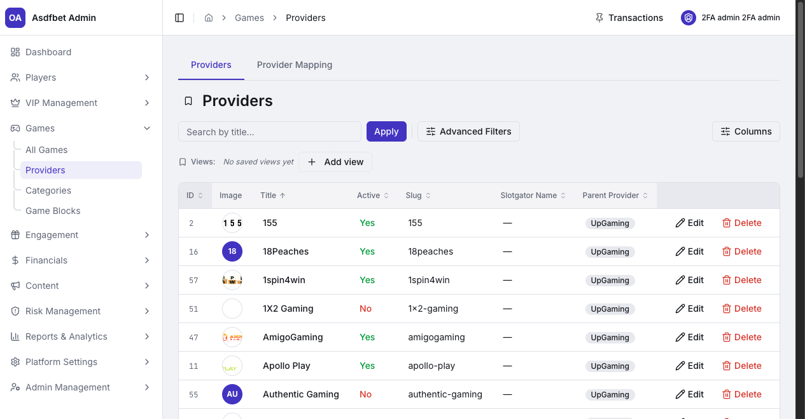 

***

### 4.4 Categories

**Core Purpose:** Defines the game-type taxonomy (Slot, Table Games, Live Casino/Game Shows, Instant Games, Lottery, Arcade, Other) used to organize the catalog — and, critically, carries the **wagering-contribution rule** for each type.

**Primary Capabilities & Actions:**

* **Add Category** / **Edit** / **Delete**, plus standard Search, Advanced Filters, and Columns.
* **Table columns:** ID, Image, Title, Slug, **Wager Weight**, Active, Created.
* **Edit Category form:** multi-language title input (English/Korean/Chinese title fields, switchable via language tabs), Slug, **Wager Weight** (numeric), and an **Active** switch.
* **Wager Weight** is the key business-logic field here: it's the multiplier applied to bets in that category when calculating progress toward a bonus's wagering requirement. In the observed data, Slot and Game Shows carry a weight of `1` (full contribution) while Table Games and Instant Games carry `0.5` (half contribution) — a common anti-abuse mechanic since low-volatility game types (like table games) are otherwise an easy way to "grind through" a wagering requirement with minimal risk.

**Standard Operational Workflow:**

1. Admin adds a new category when a new game type is introduced to the catalog (e.g., a new provider brings a game type not yet represented).
2. Admin sets/revisits **Wager Weight** whenever bonus abuse patterns emerge in a category (e.g., players clearing wagering requirements almost risk-free via a specific game type) — lowering the weight there directly slows down bonus-clearing speed for that category.
3. Admin manages **Active** to control whether the category (and by extension, its games) is surfaced at all in category-based filtering/navigation.
4. Multi-language title fields are kept in sync here so the category name displays correctly across the platform's supported locales (English/Korean/Chinese observed).

> **Admin tip:** A Wager Weight change is a bonus-economics lever, not just a labeling setting — treat it with the same care as a bonus terms change, since it retroactively affects how fast in-progress wagering requirements clear for any player currently playing games in that category.

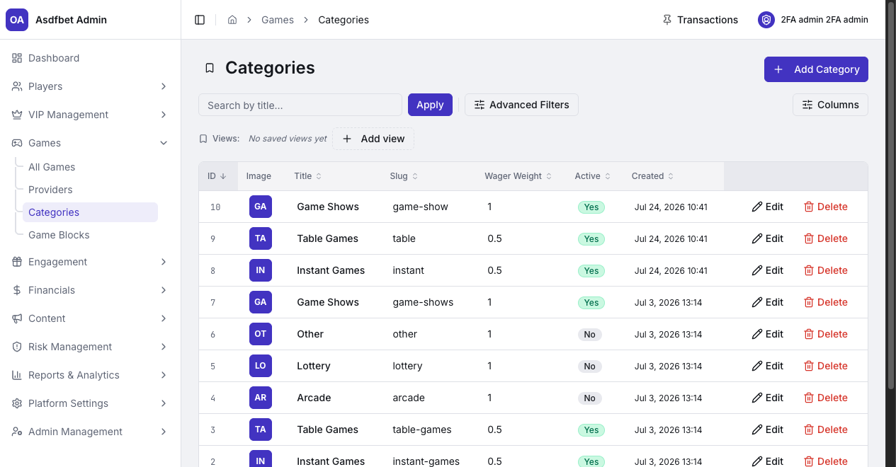 

***

### 4.5 Game Blocks

**Core Purpose:** Curated, manually-ordered collections of games used to populate specific lobby sections/storefront placements (e.g., "Slot Games", "Live Casino") — the merchandising layer on top of the raw catalog.

**Primary Capabilities & Actions:**

* **Add Block** — creates a new named collection.
* **Table columns:** ID, Logo, Name, Slug, **Position** (display order), Active, Created, and row actions **Manage Games** / **Edit** / **Delete**.
* **Manage Games (per block):** A dual-panel picker —
  * **Block Games** — the titles currently in the block (with per-game reorder controls and a remove action), showing a live count (e.g., "31 games in this block").
  * **Available Games** — a searchable catalog picker (search by title or ID) to add more titles into the block.
* **Edit** — updates the block's own metadata (name, slug, position, active status, logo).

**Standard Operational Workflow:**

1. Marketing/operations decides a lobby section needs to feature a specific set of games (e.g., a "Slot Games" showcase, a seasonal promotion block).
2. Admin creates the block via **Add Block**, or opens an existing block's **Manage Games**.
3. Admin searches **Available Games** and adds titles into **Block Games**, then uses the per-game reorder controls to set display order within the block.
4. Admin sets the block's own **Position** (via Edit) to control where this block appears relative to other blocks on the storefront, and toggles **Active** to publish/unpublish the whole block.
5. Admin periodically revisits blocks alongside **Game Analytics** ([4.2](documentation.md#42-game-analytics)) to swap underperforming titles out for stronger ones, keeping featured placements aligned with actual player engagement and revenue.

> **Admin tip:** Game Blocks is the tool for "what players see first," while Game Analytics is the tool for "what actually makes money" — the recurring merchandising workflow is comparing the two and adjusting block contents so the two lists move closer together over time.

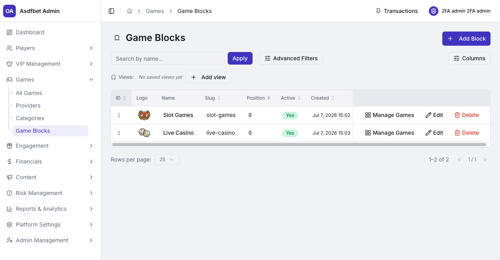 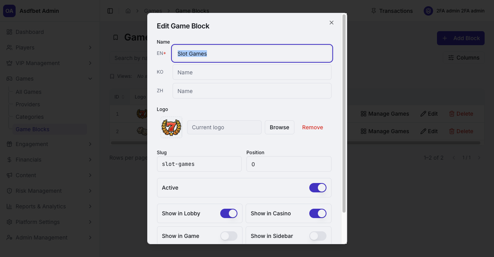 

***

## 5. Engagement

### Section Overview

Engagement is the platform's player-retention and reward engine. It defines every mechanism used to encourage deposits, reward loyalty, and re-activate players: promotional **bonuses**, recurring **cashback/rakeback**, gamified **prize wheels**, competitive **leaderboards**, and the underlying **loyalty rank ladder** that ties all of the above together. Ranks in particular are the connective tissue of this module — a player's rank drives their cashback/rakeback rate, which bonus-wheel prize pool they draw from, and their VIP tier badge (see [3.2](documentation.md#32-vip-player-profile--tab-by-tab-purpose)).

***

### 5.1 Bonuses

**Core Purpose:** Create and manage promotional bonus campaigns — the platform's primary lever for driving deposits and player activity.

**Primary Capabilities & Actions:**

* **Search, Advanced Filters, Columns, Saved Views** — consistent with other list modules.
* **Table columns:** ID, Name, Type, Trigger, Wagering (coefficient), Status (Active/Inactive toggle), Expires (days), Edit.
*   **Three bonus types**, each created via its own wizard (Add Bonus → pick a type → Create Bonus):

    | Type                 | Description                                                | Distinguishing fields                                                                                                                                                                                                                                                                                                                                                                               |
    | -------------------- | ---------------------------------------------------------- | --------------------------------------------------------------------------------------------------------------------------------------------------------------------------------------------------------------------------------------------------------------------------------------------------------------------------------------------------------------------------------------------------- |
    | **Cash Prize Bonus** | "Bonus money that unlocks to real balance after wagering." | **Split number** — pays the unlocked amount out in N equal installments rather than all at once.                                                                                                                                                                                                                                                                                                    |
    | **Bonus Money**      | "Playable bonus money with a localized description."       | **Bonus cap (×)** — caps total cashout as a multiple of the bonus amount (0 = uncapped).                                                                                                                                                                                                                                                                                                            |
    | **Free Spins**       | "Free spins on selected provider games."                   | A 7-step wizard (Basic Info → **Free Spin Type** → Select Games → Campaign & Trigger → Bonus Configuration → Currency Config → Review) built around six **Free Spin Type** variants tied to the Upgaming aggregator: Type 1 (spin count only), Type 2 (bet level: min/mid/max), Type 3 (bet per line), Type 4 (bet range freebet), Type 5 (fixed bonus amount), Type 6 (fixed FreeRoundBet amount). |
* **Shared configuration fields across all bonus types:**
  * **Basic Info** — multi-language name/description (English/Korean/Chinese), Active toggle.
  * **Games scope** — Include or Exclude mode against Categories, Providers, or specific Games, controlling which bets count toward wagering progress (see also [4.4 Wager Weight](documentation.md#44-categories), which is a category-level version of the same idea).
  * **Wagering Rules** — Wagering coefficient (multiplier on the bonus amount to compute required wager).
  * **Currency Config** — per-currency tabs (KRW, CNY, VND, PHP, KHR, THB, IDR) each with Amount (flat or, via a switch, percentage-of-deposit), Min/Max deposit, Min/Max bet, Max amount.
  * **Campaign & Eligibility** — Campaign duration (days the offer stays available), Awarded-bonus expiry (days once claimed), **Trigger** (`Deposit` \[with a Deposit-order sub-selector: First/Second/.../Any], `Manual award (CRM)`, `Promo code`, `Bonus wheel`, `Leaderboard reward`, `Affiliate registration`), and **Recurrence** (`None`, `Daily`, `Weekly`, `Monthly`).

**Standard Operational Workflow:**

1. Marketing/CRM decides a promotion is needed (e.g., a deposit-match welcome offer, a reload bonus, a free-spins drop for a new game launch).
2. Admin clicks **Add Bonus**, picks the type matching the promotion's mechanic, and works through the wizard/form.
3. Admin scopes which games count toward wagering (Include/Exclude by category/provider/game) to prevent low-risk grinding (see the Wager Weight cross-reference).
4. Admin sets the **Trigger** — a deposit-based promo, a manual CRM award to specific players, a promo-code redemption, or a reward issued automatically from the Bonus Wheel or a Leaderboard win.
5. Admin reviews and saves; the bonus becomes available per its Active toggle and Campaign duration.
6. Ongoing: admin toggles **Status** off to pause a campaign without deleting its configuration, and monitors the **Bonuses → Analytics** tab for performance (currently shown as "Coming soon" — not yet built out).

> **Admin tip:** `Trigger = Bonus wheel` or `Leaderboard reward` means this bonus definition isn't claimed directly by players — it's the payout vehicle referenced by a Bonus Wheel prize slot or a Leaderboard prize place. Check [5.4](documentation.md#54-bonus-wheel) / [5.5](documentation.md#55-leaderboards) before assuming an unused-looking bonus is dead.

  

***

### 5.2 Cashback

**Core Purpose:** Recurring return of a percentage of a player's **net losses** — a standing loyalty mechanic rather than a one-off campaign.

**Primary Capabilities & Actions:**

* **Table columns:** ID, Days (payout cycle length), Name, Slug, Min Threshold (minimum net-loss amount to qualify for a payout), Active, Modify Uid, Edit.
* Three cycle presets observed: `daily` (1 day), `weekly` (7 days), `monthly` (30 days).
* **Edit Cashback:** multi-language Name, Slug, Days, Min Threshold, Excluded categories, Excluded providers, Active toggle. The actual **percentage** paid out is not set here — it comes from the player's current rank via the **Cashback %** / **Cashback Max ($)** fields on that rank (see [5.6](documentation.md#56-ranks)).

**Standard Operational Workflow:**

1. Admin defines/maintains the cycle definitions (daily/weekly/monthly) that determine how often cashback is calculated and paid.
2. The actual cashback rate a given player receives is driven by their **Rank** — higher ranks earn a higher Cashback % up to their Cashback Max, so no per-player configuration is needed here.
3. Admin uses **Min Threshold** and category/provider exclusions to prevent cashback from being paid on negligible losses or from low-risk game types being used to farm cashback.
4. Admin toggles a cycle **Active/Inactive** to pause a specific cashback cadence platform-wide.

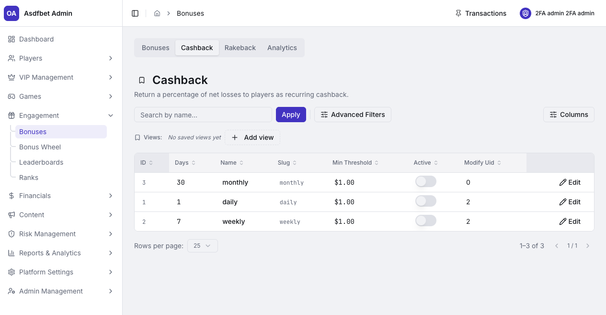

***

### 5.3 Rakeback

**Core Purpose:** Recurring return of a percentage of **wager-based rake** (the house's structural edge on turnover, distinct from net losses) — the platform's second standing loyalty mechanic, structured identically to Cashback.

**Primary Capabilities & Actions:**

* Identical structure to Cashback: table columns ID, Days, Name, Slug, Min Threshold, Active, Modify Uid, Edit; same three cycle presets (daily/weekly/monthly).
* Rate is likewise driven by the player's **Rank** — the **Rakeback %** / **Rakeback Max ($)** fields (see [5.6](documentation.md#56-ranks)), not configured per-cycle here.

**Standard Operational Workflow:** Same as Cashback ([5.2](documentation.md#52-cashback)) — admin manages cycle cadence and thresholds here; the payout rate itself is a function of rank.

> **Admin tip:** Cashback rewards players for **losing** (net losses); Rakeback rewards players for **playing** (wager volume/rake), regardless of whether they're up or down. A player can qualify for one, both, or neither on a given cycle depending on their activity pattern — they are not the same mechanic despite sharing an identical admin UI.

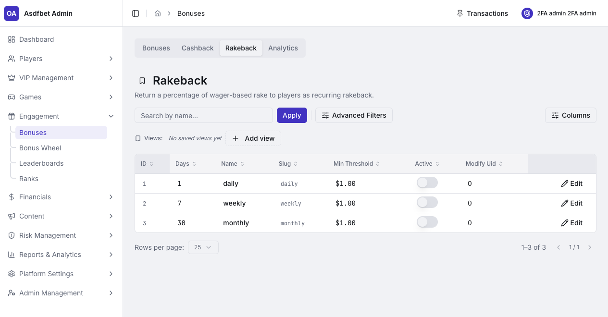

***

### 5.4 Bonus Wheel

**Core Purpose:** A gamified, chance-based reward mechanic ("spin the wheel") where win odds are configured per loyalty-rank tier — used to add an engagement/retention hook beyond straightforward bonus claiming.

**Sub-views:**

| Tab                | Purpose                                                                                                                                                                                                                                                                                                                                                                                  |
| ------------------ | ---------------------------------------------------------------------------------------------------------------------------------------------------------------------------------------------------------------------------------------------------------------------------------------------------------------------------------------------------------------------------------------- |
| **Prize Catalog**  | The master list of possible prizes: ID, Image, Type (`Lottery Ticket`, `Custom Cash`, `Wheel Spin`, etc.), Name, Amount, USD Value, Active. Prizes range from low-value lottery tickets to high-value cash/crypto prizes (e.g., "1 BTC" valued at $69,000).                                                                                                                              |
| **Configurations** | **Wheel Groups** that bind a set of player ranks to a specific wheel of prizes and win chances. Observed groups: _Wheel Group 1 – Newcomer_, _Wheel Group 2 – Beginners_ (Traveler/Explorer/Adventurer), _Wheel Group 3 – Super Rank_ (Expert/Master/Grandmaster/Captain), _Wheel Group 4 – Mega Rank_ (Admiral/Space Whale/Legend/Myth) — i.e., prize quality scales with loyalty tier. |
| **Spin History**   | Full log of every spin result: player, Rank Group, Prize Name/Type, Amount, Value (USD), Date — searchable, filterable by prize type, exportable to CSV.                                                                                                                                                                                                                                 |

**Primary Capabilities & Actions:**

* **Configure Prizes & Chances** (per wheel group): a slot-based probability editor. Each spin draws a random number between 1 and 1,000,000; each slot claims a portion of that range (e.g., a slot with chance 100,000 = 10% win probability). All slot chances **must sum to exactly 1,000,000** before the configuration can be saved — the UI shows a running total and each slot's resulting probability percentage live.
* **Add Group / Edit** — create or modify which ranks feed into a given wheel and whether it's active.

**Standard Operational Workflow:**

1. Admin maintains the **Prize Catalog** — adding new prizes (lottery tickets, cash amounts, crypto, extra spins) and their USD value for cost-tracking purposes.
2. Admin assigns ranks into **Wheel Groups** so that higher-tier players draw from a richer prize pool, reinforcing the loyalty ladder.
3. Admin opens **Configure Prizes & Chances** for a group and allocates the 1,000,000-unit probability budget across slots — lowering a high-value prize's chance value to make it rarer, raising a low-value prize's chance to make it common filler.
4. Ongoing: admin reviews **Spin History** to audit payout volume/value per rank group and confirm the configured odds are producing the intended prize mix in practice.

> **Admin tip:** Because slot chances must total exactly 1,000,000, changing one prize's odds always requires rebalancing at least one other slot in the same wheel — treat this as an all-or-nothing edit, not a single-field tweak.

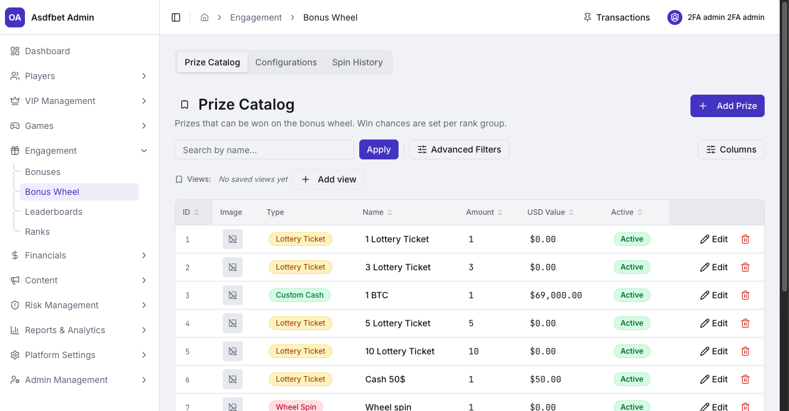 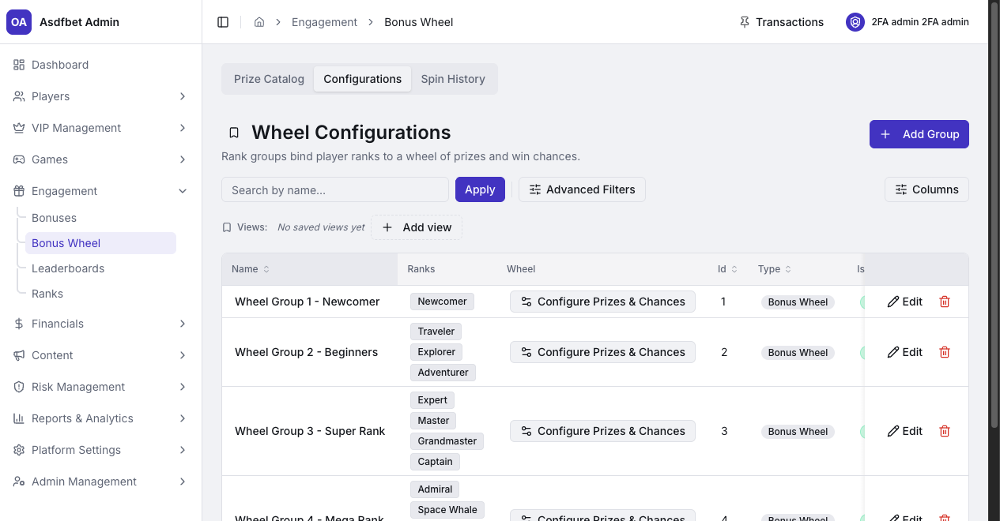  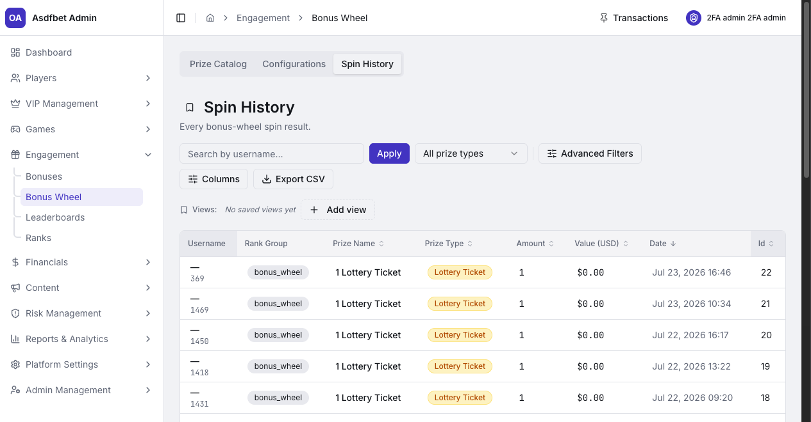

***

### 5.5 Leaderboards

**Core Purpose:** Time-boxed wagering competitions that rank players by activity (typically wager volume) and pay cash/prize rewards to top finishers — a short-term engagement spike mechanic, distinct from the always-on Cashback/Rakeback/Bonus Wheel systems.

**Sub-views:**

| Tab              | Purpose                                                                                                                                                                |
| ---------------- | ---------------------------------------------------------------------------------------------------------------------------------------------------------------------- |
| **Leaderboards** | The competition list: ID, Name, Starts/Ends (date-time), Winning Places, Active, Finished, with **View** / **Edit** / **Delete** actions.                              |
| **Prizes**       | A dedicated prize catalog for leaderboard payouts (separate from the Bonus Wheel's catalog): ID, Name, Type (e.g., `Custom Cash`), Amount, USD Value, Active, Item Id. |
| **Win Logs**     | Record of every leaderboard payout: User, Player ID, Leaderboard, Win Position, Wagered (amount), Prize Name/Type — searchable, filterable, exportable.                |

**Primary Capabilities & Actions (Edit Leaderboard):**

* **Basics** — Name; localized Title/Sub Name/Sub Sub Name/Post text (English/Korean/Chinese) and per-language banner images (recommended 800×340).
* **Schedule & Limits** — Start Date / End Date (date+time), **Min Bet** (minimum single bet that counts toward standing), **Min Rank** (minimum loyalty rank required to participate), **Prize Places** (how many finishing positions are paid).
* **Games Filter** — Included games (leave empty to count all), Excluded categories/providers/games.
* **Flags** — **Is Active** (visible on the player site) and **Auto-Give Prizes** (automatically credit winners when the competition ends, vs. manual payout).
* **Prizes by Place** — assign a specific prize (from the Prizes catalog) to each paid finishing position (e.g., 1st = 3,000,000 KRW, 2nd = 2,000,000 KRW, 3rd = 1,000,000 KRW), with Add/Remove place controls.

**Standard Operational Workflow:**

1. Marketing plans a competition (e.g., a weekend wagering race) and sets its Start/End window.
2. Admin creates/edits the leaderboard's localized content and banner images for the promotions page.
3. Admin sets **Min Bet** and **Min Rank** to control entry difficulty/eligibility, and a **Games Filter** to scope which play counts (consistent with the Wager Weight / bonus-scoping pattern used elsewhere).
4. Admin defines **Prize Places** and assigns a specific prize to each place from the Prizes catalog.
5. Admin decides whether prizes are paid automatically (**Auto-Give Prizes** on) at the competition's end, or held for manual review/payout.
6. After the competition ends, admin reviews **Win Logs** to confirm correct payout and audit the final standings.

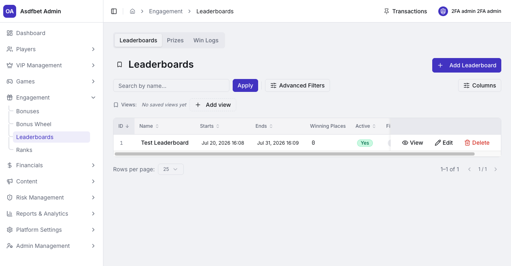  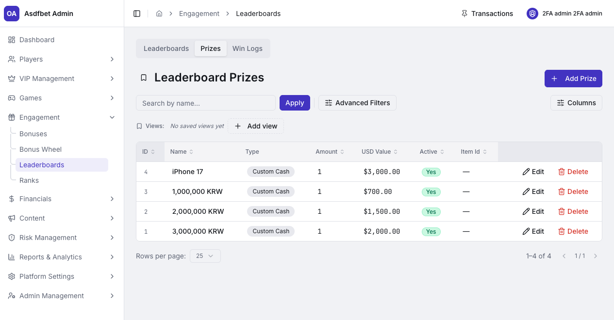 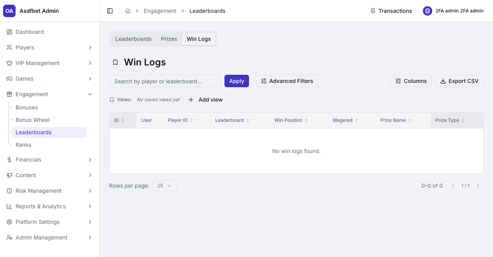

***

### 5.6 Ranks

**Core Purpose:** Defines the platform's 12-tier loyalty ladder — the single source of truth that determines a player's cashback/rakeback rate, which Bonus Wheel prize pool they draw from, and the VIP tier badge shown on their profile. This is the most structurally important sub-module in Engagement since nearly every other reward mechanic reads from it.

**Primary Capabilities & Actions:**

* **Table columns:** ID, Rank Name, Start Level / End Level, Min Wager / Max Wager, Cashback %, Edit/Delete.
* **The 12 tiers observed** (name — wager range — cashback %): Newcomer ($1–$499, 1.2%), Traveler ($500–$4,999, 1.6%), Explorer ($5,000–$19,999, 2.4%), Adventurer ($20,000–$49,999, 3.2%), Expert ($50,000–$99,999, 4.0%), Master ($100,000–$199,999, 4.8%), Grandmaster ($200,000–$399,999, 5.6%), Captain ($400,000–$799,999, 6.4%), Admiral ($800,000–$1,999,999, 7.2%), Space Whale ($2,000,000–$4,999,999, 8.0%), Legend ($5,000,000–$19,999,999, 8.8%), Myth ($20,000,000+, 9.6%) — a strictly increasing ladder on both lifetime wager and reward rate.
* **Edit Rank fields:**
  * Multi-language Rank Name.
  * **Level Range** — Start Level / End Level (an internal numeric level band the rank spans, distinct from the dollar thresholds).
  * **Wager Range ($)** — Min Wager / Max Wager, the lifetime-wager thresholds that place a player into this rank.
  * **Rewards** — Cashback % and Cashback Max ($), plus Rakeback % and Rakeback Max ($) — the actual rates paid out by the Cashback ([5.2](documentation.md#52-cashback)) and Rakeback ([5.3](documentation.md#53-rakeback)) cycles for a player at this rank.

**Standard Operational Workflow:**

1. Admin reviews the rank ladder periodically to ensure wager thresholds and reward rates remain commercially sound (e.g., not too generous at low tiers, not too stingy to retain high-value players).
2. When adjusting player economics, admin edits a rank's **Cashback %/Max** or **Rakeback %/Max** here rather than in the Cashback/Rakeback modules — those modules only control payout cadence, not rate.
3. Admin cross-checks rank changes against **Bonus Wheel → Configurations** ([5.4](documentation.md#54-bonus-wheel)) to make sure the wheel-group-to-rank mapping still makes sense after any rank restructuring.
4. New players start at the bottom tier (Newcomer) and progress automatically as lifetime wager crosses each Min Wager threshold — this is also what feeds the "tier/rank label" shown on a VIP player's profile header (see [3.1](documentation.md#31-vip-players)).

> **Admin tip:** Ranks is the root of the loyalty system — changes here ripple into Cashback/Rakeback payout rates, Bonus Wheel prize-pool assignment, and VIP profile badging all at once. Treat rank-table edits as a platform-wide economics change, not a cosmetic label update.

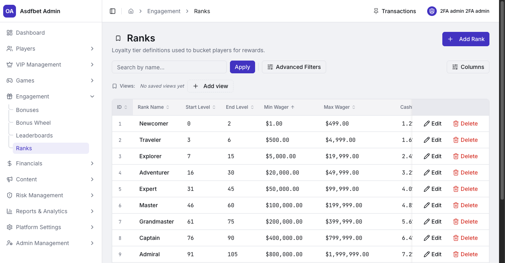 

***

## 6. Financials

### Section Overview

Financials is the platform's money-movement ledger and payout control point. Where Players Management shows financial data in the context of a single account, Financials shows it platform-wide: every deposit, withdrawal, and wallet adjustment across all players, plus the dedicated operational queue for approving or rejecting pending player withdrawals. It's organized into two sub-views: **Transactions** and **Withdrawal Requests**.

***

### 6.1 Transactions

**Core Purpose:** The platform-wide ledger of every deposit, withdrawal, and wallet movement — the financial audit trail behind the Dashboard's Deposits/Withdrawals/GGR figures.

**Primary Capabilities & Actions:**

* **Search & filter:**
  * Free-text search by username.
  * Quick filters: **Type**, **Status** dropdowns.
  * **Advanced Filters** (rule-builder) supporting: `ID`, `Player`, `Username`, `Sid`, `TX Ref`, `Type`, `Status`, `Provider`, `Currency`, `Currency Wallet`, `Ip`, `Added To Player`, `First Deposit`, `Amount`, `Amount (sys)`, `Amount (wallet)`, `Created`.
  * **Column customization** and **Saved Views** (a default "Transactions" view is pre-saved).
* **Transaction Type values:** `Deposit`, `Manual Deposit`, `Withdrawal`, `Manual Withdrawal`, `Free Money`, `Balance Correction (Deposit)`, `Balance Correction (Withdrawal)` — i.e., the ledger captures both player-initiated and admin-initiated (manual/correction) money movements as first-class, filterable types.
* **Transaction Status values:** `Initialized`, `Pending`, `Confirming`, `Completed`, `Failed`, `Canceled` — the full lifecycle a transaction moves through, relevant for crypto payments in particular (`Confirming` = awaiting blockchain confirmations).
* **Table columns:** ID, Player (links to profile), Type, Amount, Status, Provider (payment provider, e.g., `agentpay`, `nowpayments`), TX Ref, Created.
* **Transaction detail view** (click a row): Basic Info (ID, Player, Type, Status, Created), Amount & Currency (Amount, Amount (sys) — normalized to the platform's base/system currency, Amount (wallet) — in the player's wallet currency, Net (sys)/Net (wallet), Fee), and Balance (Balance Before / Balance After) — giving a full before/after reconciliation view of the player's wallet at the moment of the transaction.
* **Export CSV** — exports the current filtered transaction list.
* **Transaction Analytics tab** — reserved for future charting/breakdowns; currently shows "Coming soon."

**Standard Operational Workflow:**

1. Admin uses this view for financial investigations — a player dispute over a missing deposit, a support ticket about a delayed withdrawal, or a reconciliation check against a payment provider's own records.
2. Admin filters by **Type** and/or **Status** to isolate a category of activity (e.g., all `Failed` withdrawals in a date range, or all `Manual Deposit`/`Balance Correction` entries to audit admin-initiated adjustments).
3. Admin opens a transaction's detail view to confirm exact amounts in both system and wallet currency, and to verify the player's balance before/after — the authoritative record when a player disputes their balance.
4. Admin exports filtered results to CSV for finance/accounting reconciliation or reporting outside the panel.

> **Admin tip:** `Amount (sys)` vs `Amount (wallet)` matters whenever the platform's base currency differs from the player's wallet currency (e.g., a KRW wallet transaction normalized to USD) — always check `Amount (sys)` when comparing figures across players on different currencies, since raw `Amount (wallet)` values aren't directly comparable.

 

***

### 6.2 Withdrawal Requests

**Core Purpose:** The dedicated approval queue for player withdrawal requests — the operational counterpart to the Dashboard's **Pending Withdrawals** KPI ([1](documentation.md#1-dashboard-overview)), and the module where an admin actually clears that backlog.

**Primary Capabilities & Actions:**

* **Search & filter:** username search, **Status** dropdown, **Provider** dropdown, plus Advanced Filters/Columns/Export CSV consistent with other list modules.
* **Table columns:** ID, Player, Amount, Method (payment provider, e.g., `agentpay`, `nowpayments`), Address (destination address/account, relevant for crypto payouts), Status, Requested (timestamp).
* **Status values observed:** `Requested` (awaiting admin decision), `Pending`, `Cancelled`, `Completed` — only rows in `Requested` status expose the row-level **Approve** / **Reject** actions directly in the table; other statuses only expose **Review**.
* **Review dialog** (available for any row): full detail broken into —
  * **Basic Info** — ID, Player, Status, Requested timestamp.
  * **Amount & Currency** — Amount, Amount (sys), Amount (wallet), Fee, Net Amount.
  * **Destination** — Method, Address, Payout Status, Payout ID (the payment provider's own reference for tracking the payout externally).
  * **Additional Details** — **Locked** (Yes/No — prevents processing, e.g., during a risk hold), **Returned to Player** (Yes/No — whether a rejected withdrawal's funds were credited back), and a free-text **Notes** field.
  * **Approve** / **Reject** actions available directly from the dialog.

**Standard Operational Workflow:**

1. Admin opens Withdrawal Requests and filters to `Status = Requested` to see the actionable queue (mirrors the Dashboard's Pending Withdrawals count).
2. Admin opens **Review** on a request to verify the amount, destination address/account, and player context (KYC status is visible via the player-name badge in the table) before deciding.
3. If everything checks out, admin clicks **Approve** — this triggers the payout via the linked provider (Method) and the request's Payout ID/Status become trackable.
4. If the request looks suspicious (e.g., mismatched destination, insufficient KYC, risk flags on the account) or the player cancels, admin clicks **Reject** — funds are expected to be **Returned to Player**, tracked via that flag.
5. Admin can toggle a request as **Locked** to hold it (e.g., pending a Risk Management review — see the upcoming Risk Management section) without approving or rejecting outright, and can leave a **Note** documenting the reasoning for the decision, for audit purposes.

> **Admin tip:** Before approving, cross-check the player's **KYC** status ([2.1](documentation.md#21-all-players) / [2.2](documentation.md#22-kyc-queue)) and **Risk → Identity Links** ([3.2](documentation.md#32-vip-player-profile--tab-by-tab-purpose)) — withdrawal approval is the point of highest financial exposure in the entire admin panel, and it's the last checkpoint before funds actually leave the platform.

 

***

## 7. Content

### Section Overview

Content is the platform's CMS — it manages every piece of public-facing, editorial, and legal text/media shown on the player site, independent of the game/bonus logic covered elsewhere. It's organized into four sub-views: **Blog**, **Banners**, **Pages**, and **Promotions**. Every content type shares the same underlying pattern: **multi-language fields** (English/Korean/Chinese, switchable via language tabs), **recommended-size image uploads** per language, and an **Is Active** toggle to publish/unpublish without deleting.

***

### 7.1 Blog

**Core Purpose:** Manage editorial articles published on the public site — content marketing and SEO material.

**Primary Capabilities & Actions:**

* **Table columns:** ID, Image, Title, Category, Active, Is Banner, Created, Edit/Delete.
* **Create Post / Edit Post fields:**
  * **Content** (multi-language) — Title, Description, and **Post (HTML)** body, each with an EN/KO/ZH language switcher.
  * **Image** — one recommended-size upload (1600×900, 16:9) per language.
  * **Settings** — Category (e.g., `Casino`), **Is Active** toggle.
* Search by title, Advanced Filters, Columns, Saved Views — consistent with other list modules.

**Standard Operational Workflow:**

1. Marketing/content team drafts a new article and clicks **Create Post**.
2. Admin fills in Title/Description/Post body per language (translations are independent — each language tab holds its own copy, not an auto-translation).
3. Admin uploads a hero image per language and assigns a Category.
4. Admin toggles **Is Active** to publish; toggling it off later removes the post from the public site without deleting the content.

 

***

### 7.2 Banners

**Core Purpose:** Manage promotional banner images shown across the site and in-game — the platform's primary visual promotional real estate.

**Primary Capabilities & Actions:**

* **Table columns:** ID, Image, Title, Type, Active, Created, Edit/Delete.
* **Edit Banner fields:**
  * **Images** — separate **Desktop** (recommended 1920×600, 16:5) and **Mobile** image sets, each per language (EN/KO/ZH).
  * **Place to Show** — `Main Slider` or `In House Games` (i.e., banners can target the homepage hero slider or an in-game placement).
  * **Is Active** toggle.

**Standard Operational Workflow:**

1. Marketing designs desktop and mobile creative for a promotion.
2. Admin creates/edits a banner, uploading device- and language-specific images.
3. Admin selects **Place to Show** to control where the banner surfaces (main site slider vs. in-game placement).
4. Admin activates/deactivates the banner as the campaign starts/ends.

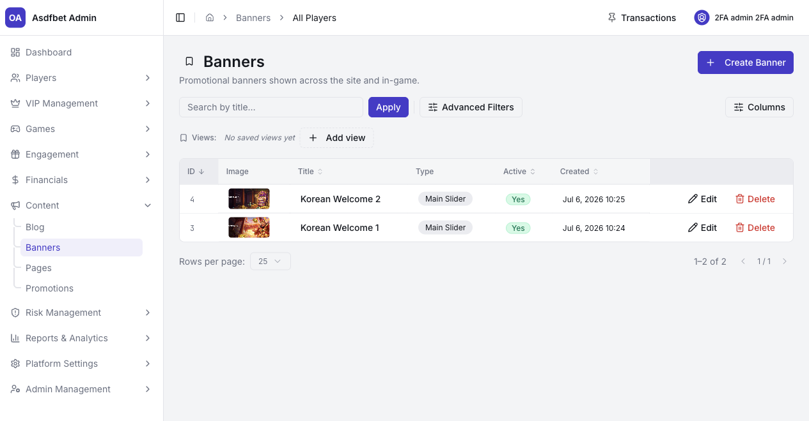 

***

### 7.3 Pages

**Core Purpose:** Manage static legal/informational content pages — Terms, Privacy, Responsible Gambling, AML Policy, Licenses, and similar compliance-critical text. Unlike Blog/Promotions, each row here is already a single language ("One row per language" per the module's own description), rather than one record with language tabs.

**Primary Capabilities & Actions:**

* **Table columns:** ID, Title, Slug, Language, Active, Created, Edit.
* **Observed pages:** Sportsbook Rules, About Us, Responsible Gambling, Affiliate, Fairness, Terms of Services, Terms and Conditions, AML Policy, Licenses, Privacy Policy.
* **Edit Page fields:** Content (rich text body), Title, Slug (URL path), **Is Active** toggle. No image/media fields — this is a text-only content type.

**Standard Operational Workflow:**

1. Legal/compliance provides updated policy text (e.g., a Terms of Service revision, a new jurisdiction's licensing disclosure).
2. Admin locates the relevant page (and language row, since each language is a separate record) and updates the **Content** field.
3. Admin confirms the **Slug** is unchanged (or deliberately updates it, which changes the page's public URL — do with care since external links may point to the old slug).
4. Admin saves; **Is Active** controls whether the page is publicly reachable.

> **Admin tip:** Because Pages are compliance-facing (Terms, AML Policy, Privacy Policy, Licenses), changes here often need legal sign-off before publishing — treat `Is Active` toggles and content edits on this module with more caution than Blog/Promotions/Banners.

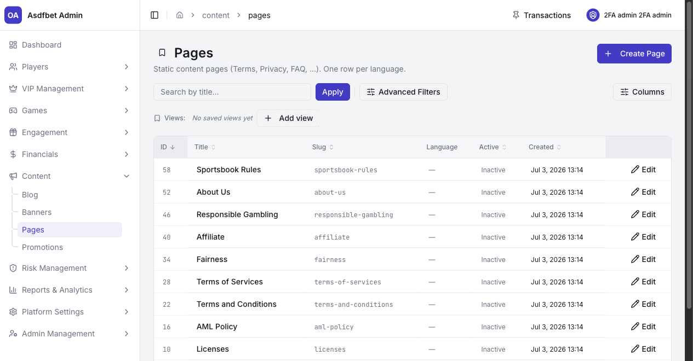 

***

### 7.4 Promotions

**Core Purpose:** Manage time-boxed promotional landing pages shown on the public site — similar to Blog in structure, but built around a **campaign window** rather than an evergreen publish date.

**Primary Capabilities & Actions:**

* **Table columns:** ID, Image, Title, Active, Starts, Ends, Created, Edit/Delete.
* **Create/Edit Promotion fields:**
  * **Content** (multi-language) — Title, Description, Post (HTML), same EN/KO/ZH pattern as Blog.
  * **Image** — per-language upload (1600×900, 16:9).
  * **Settings** — **Start Date** / **End Date** (date + time), **Is Active** toggle.

**Standard Operational Workflow:**

1. Marketing plans a promotional page tied to a specific campaign window (e.g., a month-long welcome promotion).
2. Admin creates the promotion, fills in localized content/images, and sets Start/End Date to match the campaign schedule.
3. Admin activates the promotion; unlike Blog posts, the Start/End window gives this content an inherent expiration alongside the manual **Is Active** toggle.
4. After the campaign ends, admin either lets it lapse past its End Date or manually deactivates/removes it if the campaign is cut short.

> **Admin tip:** Promotions' Start/End Date fields don't appear to auto-deactivate the record — cross-check `Is Active` even after a promotion's End Date has passed, since an expired-but-still-active promotion could stay visible depending on how the front-end reads this data.

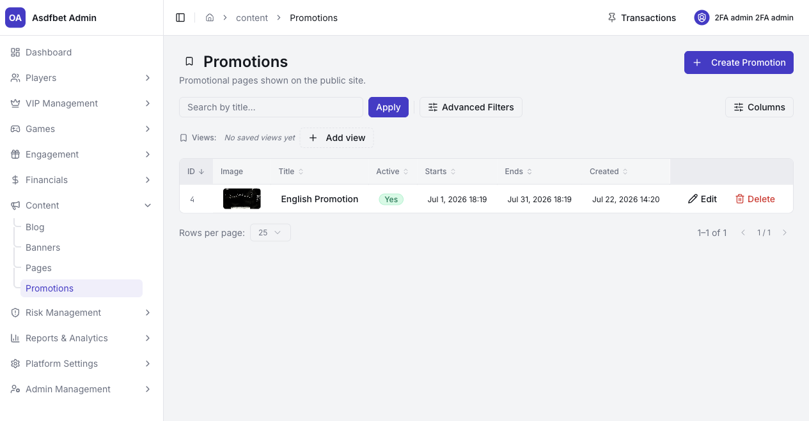 

***

## 8. Risk Management

### Section Overview

Risk Management is the platform's bulk-restriction and fraud-mitigation tool. Rather than restricting players one at a time from their individual profile ([2.1](documentation.md#21-all-players)), it lets admins define a reusable **Risk Group** — a named restriction template — and apply it to many players at once, with the restriction taking effect immediately across every member. It currently contains a single sub-view, **Risk Groups**.

***

### 8.1 Risk Groups

**Core Purpose:** Bulk-manage player restrictions via reusable, named groups, rather than toggling individual Action Controls on every affected player one by one ([2.1](documentation.md#21-all-players)). The module's own description puts it plainly: _"Add players to a group to bulk-apply restrictions — they take effect immediately on every member."_

**Primary Capabilities & Actions:**

* **Table columns:** # (ID), Name, Members (count), Restrictions (summary), Created, Description, Color, Can Bet.
* **Create Risk Group fields:**
  * **Name** (required, up to 80 characters) and an optional free-text **Description** for internal context.
  * **Tag Color** — a 12-color swatch picker; the chosen color renders as a labeled tag directly on a player's profile wherever they carry this risk group, giving other admins an instant visual flag.
  * **Restrictions** — five toggles applied to every member immediately: **Can Bet**, **Can Deposit**, **Can Withdraw**, **Bonus Allowed**, **Blocked**. These mirror the individual Action Controls on a player's Dashboard tab ([2.1](documentation.md#21-all-players)) — the group is effectively a way to set those same switches for many accounts at once. The UI explicitly warns: _"Toggle OFF to restrict."_
* **Search, Advanced Filters, Columns, Saved Views** — consistent with other list modules.

**Standard Operational Workflow:**

1. Risk/compliance identifies a pattern requiring bulk action — e.g., a cluster of accounts linked via [Risk → Identity Links](documentation.md#32-vip-player-profile--tab-by-tab-purpose) on player profiles, a batch of accounts flagged for a specific fraud pattern, or a jurisdiction-wide restriction.
2. Admin clicks **Create Risk Group**, names it descriptively (e.g., "Suspected multi-accounting — July batch"), and picks a Tag Color that will make the group visually obvious on affected profiles.
3. Admin configures the **Restrictions** toggles to match the required response — e.g., turning off **Can Withdraw** to freeze cash-out while an investigation is ongoing, without necessarily blocking the account outright.
4. Admin adds players to the group (from the group itself once created, and/or via the **Risk Group** field available in [All Players → Advanced Filters](documentation.md#21-all-players), which can be used both to filter by existing group membership and as the assignment target).
5. Restrictions apply immediately and platform-wide to every member — no per-player save step is needed once a player is in the group.
6. Ongoing: admin monitors the **Members** count and periodically reviews group membership, removing players once an investigation clears them or a restriction is no longer warranted.

> **Admin tip:** A Risk Group restriction and an individual player's Action Controls toggle are two separate mechanisms that can conflict — if a player's individual "Can Withdraw" is ON but they belong to a Risk Group with "Can Withdraw" OFF, the group-level restriction is the one meant to protect against exactly this kind of oversight, so always check group membership (not just the profile's own switches) when investigating why a player can't perform an action.

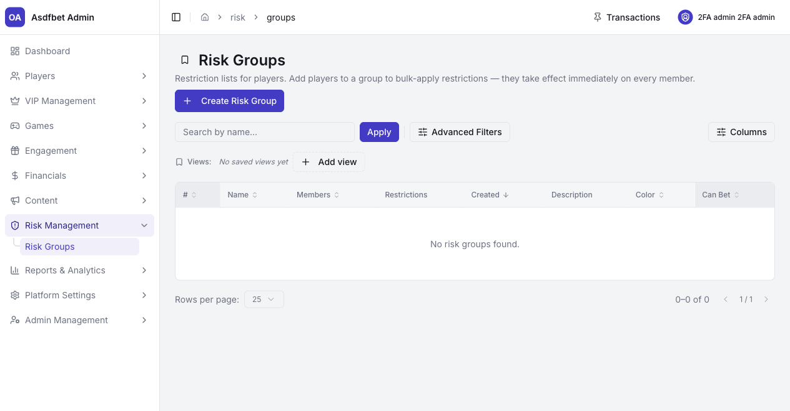 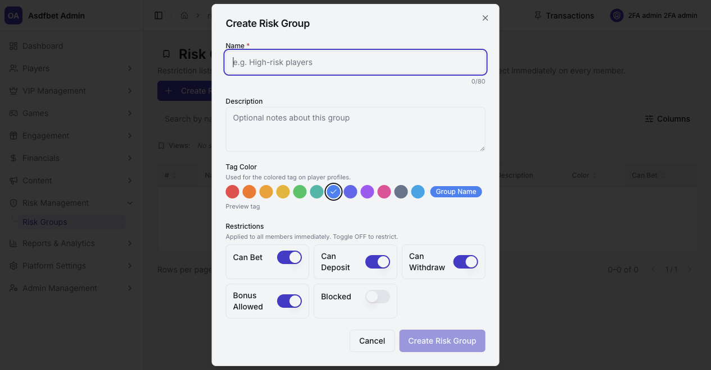

***

## 9. Reports & Analytics

### Section Overview

Reports & Analytics is the platform's master audit trail — a single, platform-wide log of literally every balance-affecting event across every player, every wallet, and every subsystem covered elsewhere in this guide (Financials, Engagement, Games). Where each other module shows its own slice of activity (e.g., the Transactions list, a player's own Logs tab), this module is the unfiltered superset all of those slices are drawn from. It currently contains a single sub-view, **Player Action Logs**.

***

### 9.1 Player Action Logs

**Core Purpose:** _"All balance-affecting actions across the platform"_ — the definitive, append-only audit log behind every wallet change on the system, used for investigation, reconciliation, and compliance/audit requests.

**Primary Capabilities & Actions:**

* **Scale:** Observed at 451,000+ records and growing — this is a high-volume operational log, not a curated report.
* **Filters:**
  * **Player ID** / **Wallet ID** direct lookup fields.
  * **Entity** dropdown — the subsystem/record type the action belongs to: `Game transaction`, `Player bonus`, `Player cashback`, `Player rakeback`, `Leaderboard win log`, `Bonus wheel win log`, `Upgaming transaction`, `Transaction`, `Withdraw request`, `Player wallet`. This list is effectively a map of every money-moving subsystem documented in this guide.
  * **Action** dropdown — the specific event type, covering the full lifecycle of gameplay (`Casino bet`, `Casino win`, `Casino rollback`, `Sport bet`, `Sport win`, `Sport rollback`), bonuses (`Claim bm bonus`, `Buy bm bonus`, `Admin give bonus`, `Activate bm bonus`, `Cancel bm bonus`, `Claim general bonus`, `Get bonus by promo code`, `Get freespin wager bonus`, `Get deposit bm/general/freespin bonus`, `Crm give bonus`, `Cancel bm bonus by admin`), loyalty rewards (`Cashback claim`, `Rakeback claim`, `Leaderboard prize cash/freespin/custom prize get`, `Bonus wheel win free spin/custom cash/custom material/lottery ticket/wheel spin`), and core financial movements (`Deposit`, `Manual deposit`, `Withdrawal`, `Withdrawal return`, `Manual withdrawal`, `Refund`, `Free money`, `Balance correction deposit`, `Balance correction withdrawal`).
  * **Advanced Filters** (full rule-builder), **Columns**, **Export CSV**.
  * **Quick Templates** — one-click filter presets: `Transactions`, `Game Transactions`, `Player Bonus`, pre-scoping the Entity filter to the matching subsystem.
* **Table columns:** ID, Player ID (links to profile), Wallet ID, Username, Entity, Action, Entity ID (the underlying record's own ID in its source table — e.g., the Transaction ID or Bonus ID), Balance Before, and a **View entity** action per row that opens an Entity Details modal with the underlying record. _(Note: in testing, this modal successfully loaded for some entity types and returned "Couldn't load entity" for others — treat it as a convenience shortcut rather than a guaranteed path, and fall back to the entity's own module — e.g.,_ [_Financials → Transactions_](documentation.md#61-transactions) _— when it fails.)_

**Standard Operational Workflow:**

1. Admin (compliance, finance, or support) receives a request that requires tracing exactly what happened to a specific player's balance — a dispute, a suspected exploit, or a regulator/auditor request.
2. Admin filters by **Player ID** (and optionally **Wallet ID** for a multi-currency account) to pull every balance-affecting event for that player in one place, across every subsystem at once — something no single other module in the panel can do, since each other module only shows its own category of activity.
3. Admin narrows further with **Entity**/**Action** filters or a **Quick Template** to isolate the category of interest (e.g., only `Casino bet`/`Casino win` rows to audit gameplay, or only bonus-related actions to trace a bonus dispute).
4. Admin uses **Balance Before** alongside the entity's own detail (via View entity or the source module) to reconstruct the exact sequence and confirm nothing is unaccounted for.
5. Admin exports the filtered log to CSV for formal audit trails, regulator submissions, or internal record-keeping.

> **Admin tip:** Because this log spans every subsystem, it's the fastest way to answer "what happened to this player's money, in order" — faster than checking Transactions, Bonuses, Cashback, and the player's own Logs tab separately. Reach for **Player Action Logs** first whenever an investigation isn't cleanly confined to one module.

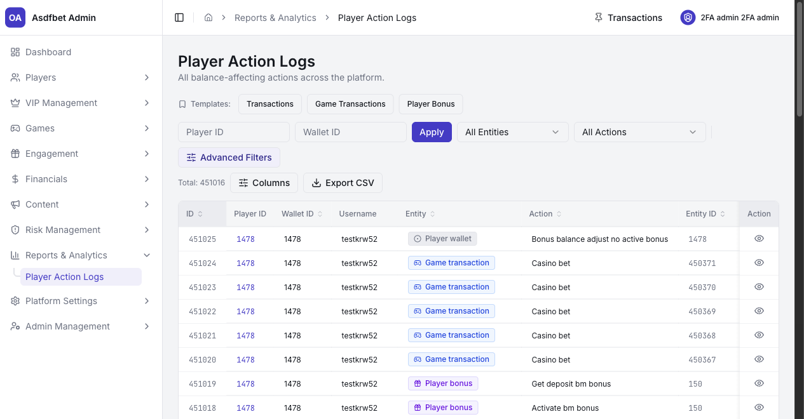

***

## 10. Platform Settings

### Section Overview

Platform Settings is the platform's global configuration layer — rules and reference data that apply system-wide rather than to a single player, game, or bonus. It's organized into three sub-views: **General** (a tabbed set of operational rules), **Countries** (geographic availability), and **Languages** (localization availability).

***

### 10.1 General

**Core Purpose:** Configure cross-cutting operational rules for withdrawals, chat, and the Bonus Wheel — the kind of platform-wide knobs that affect every player at once rather than being scoped to an individual account or campaign.

**Primary Capabilities & Actions (three tabs):**

| Tab                        | Settings                                                                                                                                                                                                                                                                                                                                                                                                                                                                                                                                                                                                                     |
| -------------------------- | ---------------------------------------------------------------------------------------------------------------------------------------------------------------------------------------------------------------------------------------------------------------------------------------------------------------------------------------------------------------------------------------------------------------------------------------------------------------------------------------------------------------------------------------------------------------------------------------------------------------------------- |
| **Deposits & Withdrawals** | **Player with KYC withdraw under** and **Player with Out KYC withdraw under** — two toggles governing auto-eligible withdrawal thresholds based on KYC status (per their description: a player can withdraw without further gating if their balance is under the configured threshold — the specific dollar threshold is expressed in the setting's own description text, e.g. "if this setting is 5 it means... under $5"). **Monthly withdraw limit** and **Weekly withdraw limit** — numeric caps (in system currency) on how much a single player can withdraw over a rolling month/week, each with its own Save action. |
| **Chat Settings**          | **Allow chat after wager** — a numeric wager threshold a player must reach before being allowed to post in platform chat. **On/Off Chat functionality** — a master switch for the entire chat feature. **Allow chat if email verified** — restricts chat access to players with a verified email address.                                                                                                                                                                                                                                                                                                                    |
| **Bonus Wheel**            | **Bonus Wheel reload time for users** — the cooldown period (in hours) between free spins a player earns automatically; per the setting's own example, a value of 24 means a player receives one new spin every 24 hours.                                                                                                                                                                                                                                                                                                                                                                                                    |

**Standard Operational Workflow:**

1. Compliance/finance periodically reviews withdrawal limits to balance player experience against fraud/AML exposure — tightening limits during a risk event, loosening them as trust in the player base grows.
2. Community/support teams use Chat Settings to manage platform chat health — e.g., raising the wager-to-chat threshold to reduce spam/bot noise, or requiring email verification to cut down on throwaway-account abuse.
3. Growth/retention teams tune the **Bonus Wheel reload time** to balance engagement (shorter cooldown = more frequent free spins, higher engagement) against cost (more spins awarded = more prize payout exposure).
4. Each numeric field has its own **Save** button — settings apply independently, not as a single form submission, so a change to one field doesn't require touching the others.

> **Admin tip:** The KYC/non-KYC withdrawal toggles and the Monthly/Weekly withdrawal limits are two different control layers — the toggles gate a specific frictionless-withdrawal _threshold amount_ based on identity verification, while the limits cap total withdrawal _volume_ over time regardless of KYC status. Review both together when adjusting withdrawal policy, since either alone gives an incomplete picture of what a player can actually cash out.

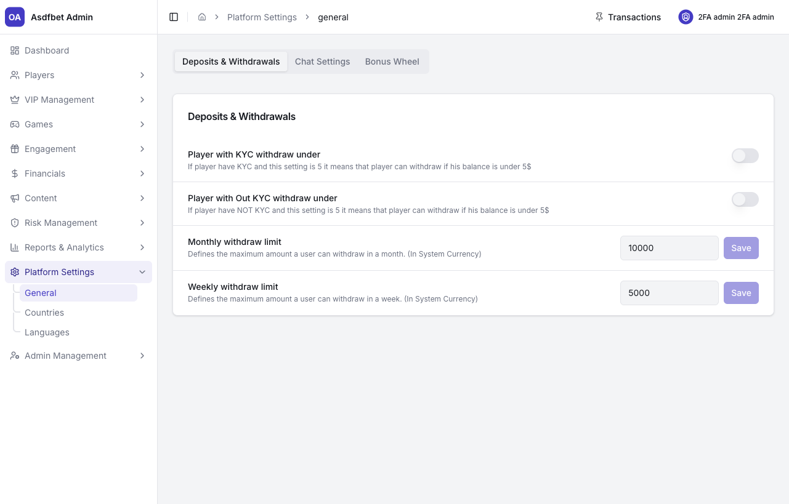 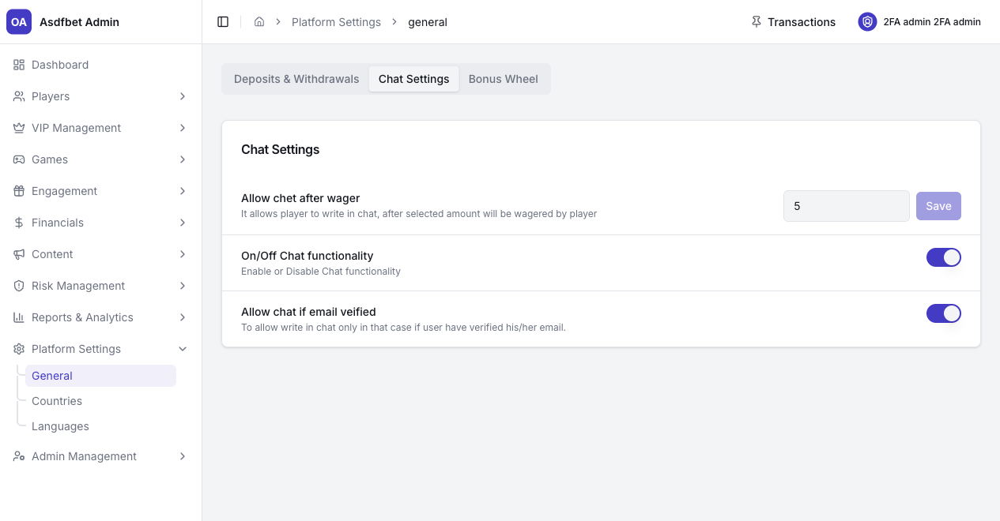 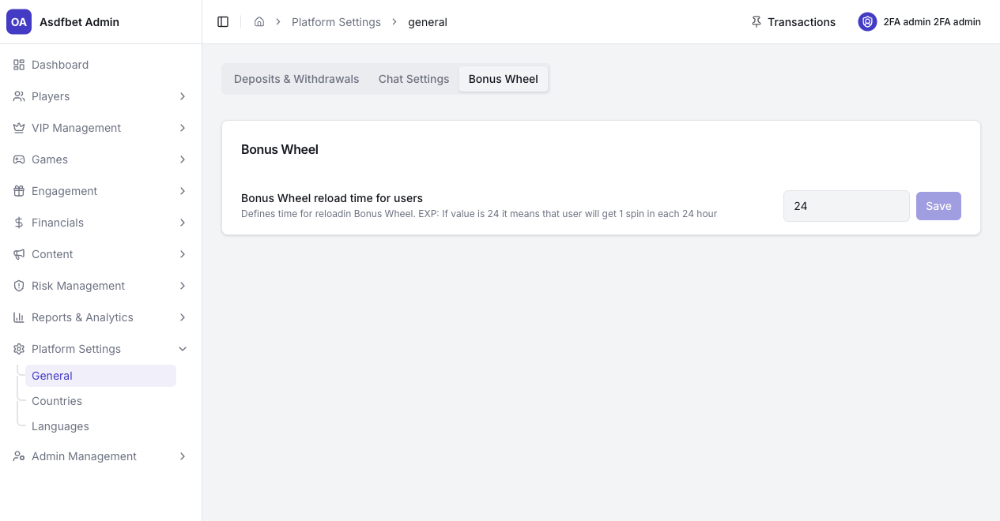

***

### 10.2 Countries

**Core Purpose:** _"Manage geographic availability and restricted regions"_ — the platform-wide geo-compliance control, determining where the platform can legally/operationally accept players.

**Primary Capabilities & Actions:**

* **Table columns:** ID, Country Name, Code (ISO), Default Lang, Active, Restricted, Phone Code, Edit — covering the full ISO country list (249 entries observed).
* **Edit Country fields:** Name, **Default Language** (which localized content a player from this country sees by default), and two independent flags:
  * **Is Active** — "Active countries are available for player registration and access."
  * **Is Restricted** — "Restricted countries are blocked from all platform access."
* Search by name/code, Advanced Filters, Columns, Export CSV — consistent with other list modules.

**Standard Operational Workflow:**

1. Legal/compliance determines which jurisdictions the platform is licensed or permitted to operate in.
2. Admin sets **Is Restricted = On** for jurisdictions where the platform must not operate at all (e.g., sanctioned countries, jurisdictions without a license) — a hard block on all access.
3. Admin uses **Is Active** to control day-to-day registration availability for jurisdictions that are legally permitted but not currently being onboarded (e.g., a soft-launch market not yet opened).
4. Admin sets **Default Language** per country so new players from that country see the platform in the expected language automatically.

> **Admin tip:** `Is Active` and `Is Restricted` are independent flags, not opposite ends of one switch — always check both before assuming a country's access state; a country could in principle be marked both inactive (not open for new signups) and not restricted (not legally blocked), which reads very differently from a hard `Is Restricted` block.

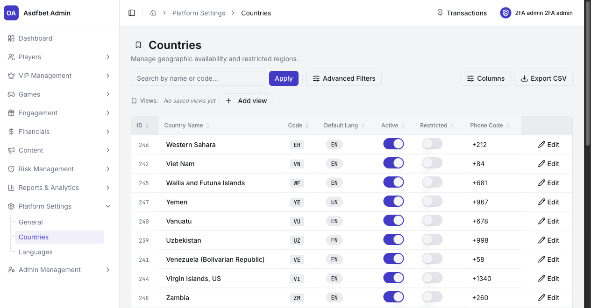 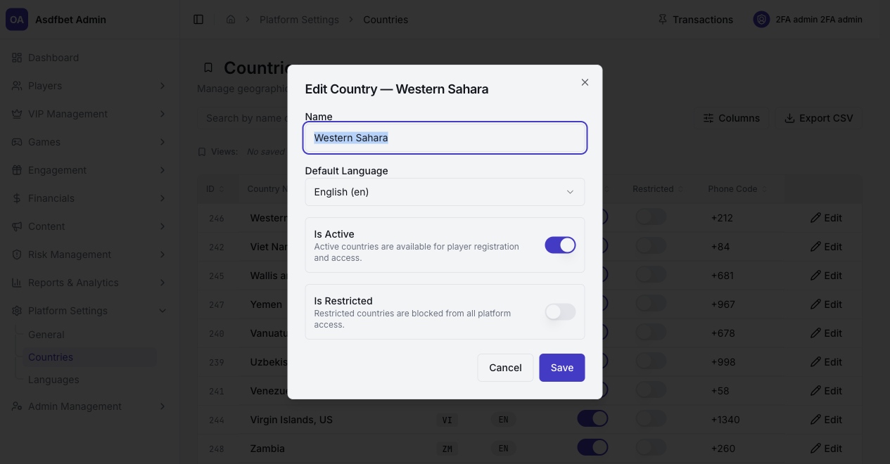

***

### 10.3 Languages

**Core Purpose:** _"Languages available across the player-facing site and admin"_ — the master catalog of every language the platform could support, with an Active flag controlling which are actually live.

**Primary Capabilities & Actions:**

* **Table columns:** ID, ISO Code, Flag (emoji), Language, Active, Modify Uid, Create Dt, Edit/Delete.
* **Add Language** — register a new language into the catalog.
* 181 languages observed in the catalog — a comprehensive ISO reference list — though in practice, content throughout the panel (Blog, Banners, Pages, Promotions, Leaderboards, Ranks — see [Content](documentation.md#7-content) and [Engagement](documentation.md#5-engagement)) is only actively localized into a small subset (English, Korean, Chinese observed), meaning most catalog entries exist as available-but-unused options rather than languages with real translated content.

**Standard Operational Workflow:**

1. When the platform expands into a new market, admin (or the underlying system) ensures the target language is **Active** in this catalog before content teams can select it in the language switcher used throughout Content/Engagement modules.
2. Admin can deactivate a language to remove it from selection without losing any historical translated content already stored for it.
3. This list is purely the _availability_ catalog — actually translating content (Blog posts, Page text, Bonus/Leaderboard copy) happens per-record in each respective module's own language tabs, not here.

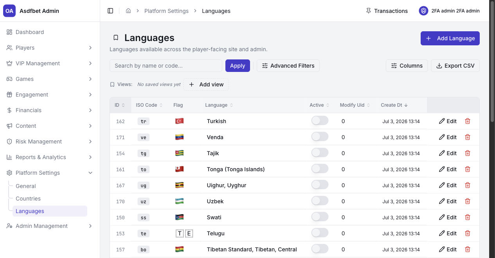

***

## 11. Admin Management

### Section Overview

Admin Management is the platform's own access-control layer — it governs who can log into this admin panel at all, and exactly what each of those staff accounts is permitted to see and do once inside. It's organized into two tightly-coupled sub-views: **Admin Users** (the staff account roster) and **Roles & Permissions** (the fine-grained access-control matrix those accounts are assigned to). This is the section that ultimately determines the real-world boundaries of every other module documented in this guide — a staff member can only perform an action described elsewhere in this manual if their assigned role grants the matching permission here.

***

### 11.1 Admin Users

**Core Purpose:** _"Manage admin users and their roles"_ — the master roster of every staff account with access to this panel, and the tool for onboarding, updating, disabling, and securing those accounts.

**Primary Capabilities & Actions:**

* **Table columns:** ID, Name, Email, Roles (assigned role name(s)), Last Login, Status (Active/Inactive), **2FA** (Enabled, with a per-row Disable action; or an **Enable 2FA** action if not yet set up), and Edit/Delete row actions.
* **Add Admin User fields:** First Name, Last Name, Email, Password (minimum 8 characters, mixed case, a number, and a symbol), and **Roles** — a multi-select chip picker against the roles defined in [Roles & Permissions](documentation.md#112-roles--permissions) (`Admin`, `Super Admin`, `Moderator`, `User` observed).
* **Edit Admin User:** same First/Last Name, Email, and Roles fields as creation, letting an existing account's role assignment be changed at any time.
* Search by name/email, Advanced Filters, Columns, Export CSV — consistent with other list modules.

**Standard Operational Workflow:**

1. When a new staff member joins (support, compliance, marketing, etc.), an existing admin with sufficient privilege clicks **Add Admin User**, sets their name/email/temporary password, and assigns the role matching their job function.
2. When a staff member's responsibilities change, admin opens **Edit** and adjusts their **Roles** assignment — access updates immediately since permissions are resolved from the role, not stored per-user.
3. When a staff member leaves or a credential is suspected compromised, admin uses the row-level **Disable** action (for the account itself) — this is the fastest way to cut off access without deleting the account's history.
4. Admin monitors the **2FA** column and pushes staff toward enabling two-factor authentication — the per-row **Enable 2FA** / **Disable** controls make this a first-class, auditable setting rather than something buried in a personal profile page.
5. Admin uses **Last Login** to spot dormant accounts that may be candidates for disabling as part of routine access hygiene.

> **Admin tip:** Disabling a user's **Status** and disabling their **2FA** are different actions with very different effects — Status controls whether the account can log in at all, while 2FA is a login-security factor for an account that's otherwise still active. Don't confuse "Disable" on the 2FA column with disabling the account itself.

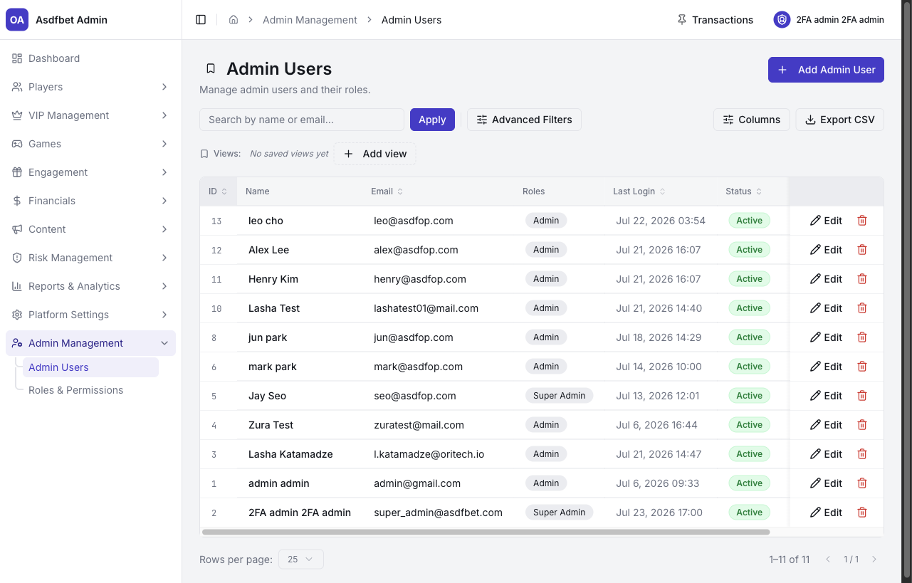 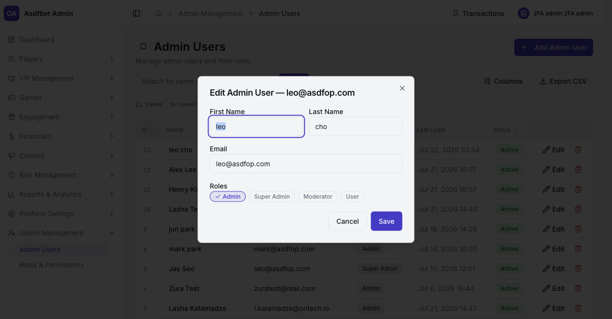

***

### 11.2 Roles & Permissions

**Core Purpose:** _"Manage roles and the pages and tabs each role can access"_ — the actual access-control definitions referenced by every account in [Admin Users](documentation.md#111-admin-users). This is the single source of truth for what "Admin," "Super Admin," "Moderator," or any custom role is actually allowed to do inside the panel.

**Primary Capabilities & Actions:**

* **Table columns:** ID, Role Name, Guard (the auth guard the role applies to — `web` observed), Permissions (count granted), Created At, Edit.
* **Roles observed:** `Admin` (146 of 147 permissions), `Super Admin` (147/147 — full access), `Moderator` (0/147 — no access granted by default), `User` (22/147 — a minimal role).
* **Add Role** — create a new named role from scratch.
* **Edit Role fields:**
  * **Role Name** and an auto-derived **Identifier** (e.g., "Moderator" → `moderator`) used internally to reference the role.
  * **Guard** — the authentication context the role belongs to.
  * **Permissions** — a searchable, expandable tree mirroring the entire panel's module structure. Top-level groups match the sidebar sections documented throughout this guide (observed: **Players** 13 permissions, **Games** 22, **Engagement** 34, **Financials** 8, **Risk Management** 7, **Content** 20, **Platform Settings** 13, **Admin Management** 17, **Reports** 6, **Other** 7 — totaling the platform's full 147-permission surface). Each group expands into feature-level sub-categories (e.g., under Players: **Customer**, **Kyc**, **Player**), and each sub-category exposes individual action-level checkboxes — typically **List**, **View**, **Create**, **Update**, **Delete**, or a feature-specific action like **Approve** for KYC.
  * Toolbar controls: **Search** (pages, tabs, actions), **Expand all** / **Collapse all**, **Select all**, **Clear**.
* A live running total (**"X / 147 granted"**) tracks how broad a role's access is while editing.

**Standard Operational Workflow:**

1. Admin (typically a Super Admin) reviews the standard roles periodically to ensure they still match the principle of least privilege — e.g., confirming Moderator genuinely has zero access by default rather than accumulating permissions ad hoc over time.
2. When a new job function needs panel access that doesn't fit an existing role, admin creates a new role via **Add Role** and grants only the specific module/action checkboxes that function requires (e.g., a content-only role with List/View/Create/Update on **Content** but nothing on **Financials** or **Admin Management**).
3. Admin uses **Search** to quickly locate a specific permission (e.g., typing "withdraw" to find every withdrawal-related action across modules) rather than manually expanding every group.
4. Once a role's checkboxes are set as intended, admin clicks **Save Changes** — every [Admin User](documentation.md#111-admin-users) currently assigned that role is affected immediately, platform-wide.
5. Admin cross-references the permission group counts against this guide's own section numbering (Players, Games, Engagement, Financials, Risk Management, Content, Platform Settings, Admin Management, Reports) to sanity-check that a role's access lines up with the operational scope that staff member is meant to have.

> **Admin tip:** Because permission changes apply immediately to every user holding that role, editing a _role_ (rather than an individual user's access) is a blast-radius action — a single Save Changes here can expand or restrict what dozens of staff can do at once. Prefer creating a new, narrowly-scoped role over broadening an existing shared role like Admin or Moderator when only one person's access actually needs to change.

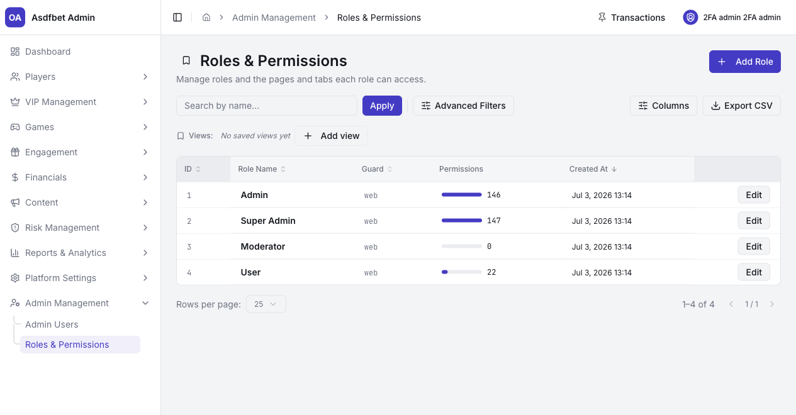 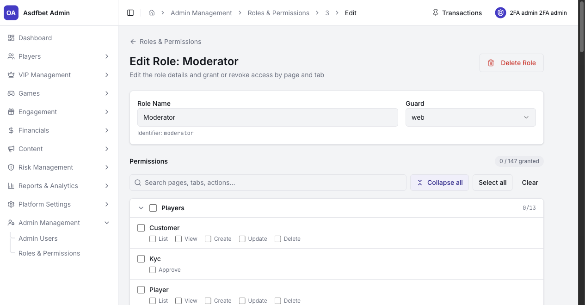

***

_This concludes the modular documentation of the Asdfbet Admin Panel, covering all eleven top-level sections of the sidebar: Dashboard, Players Management, VIP Management, Games, Engagement, Financials, Content, Risk Management, Reports & Analytics, Platform Settings, and Admin Management._
