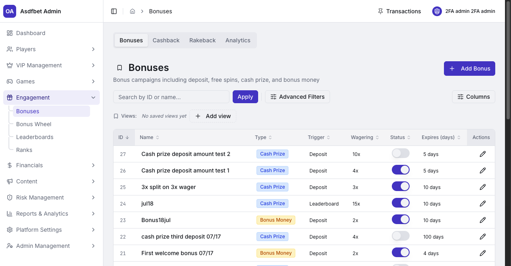
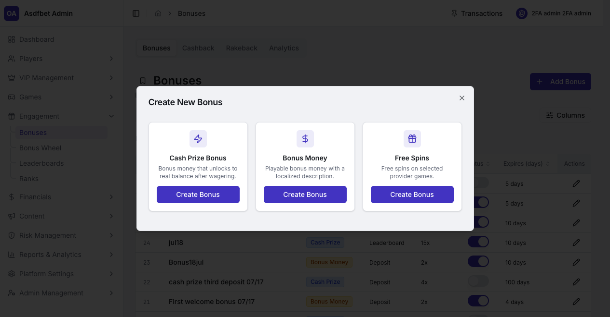
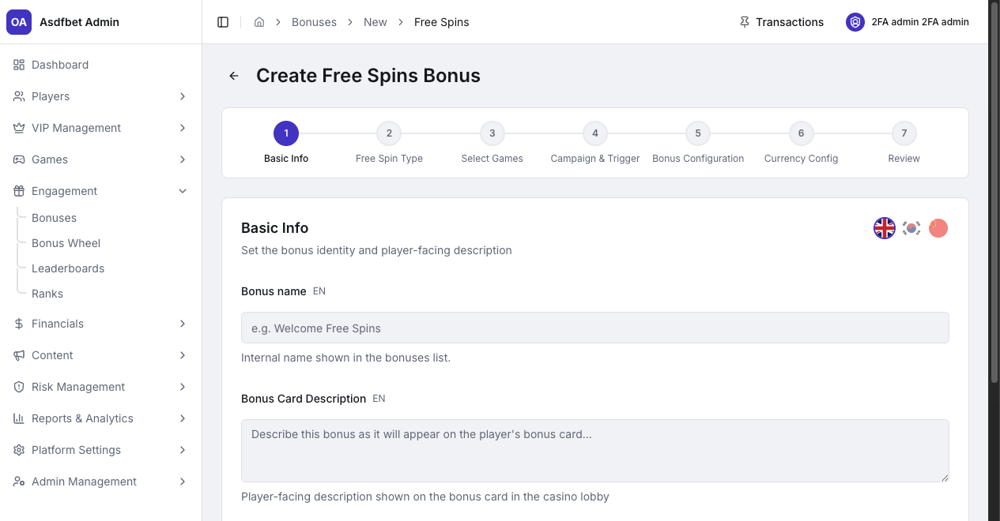
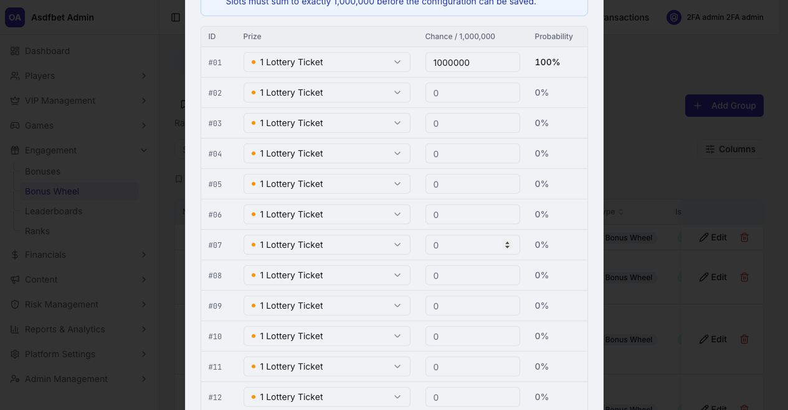
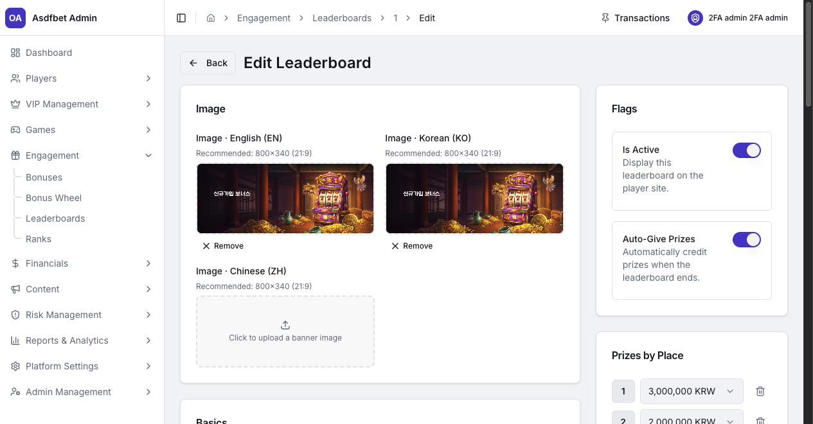
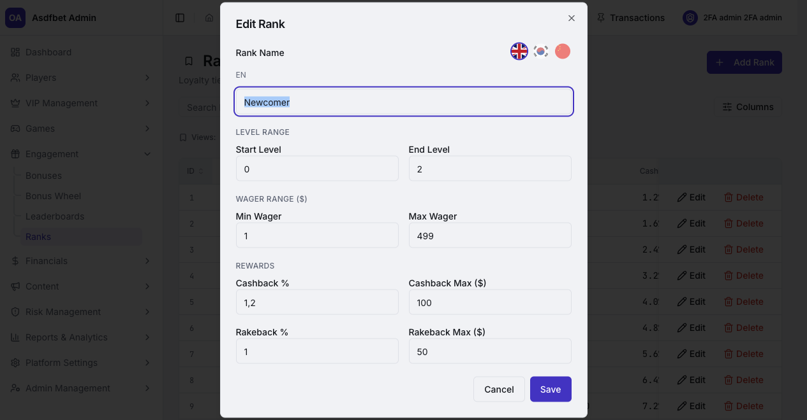

# Engagement

## Engagement

Use Engagement to create promotions and manage ongoing loyalty rewards.

[Open the complete Engagement manual](documentation.md#5-engagement)

### Bonuses

Create Cash Prize, Bonus Money, or Free Spins campaigns. Configure localized content, game eligibility, wagering rules, currency amounts, triggers, and recurrence.

Use the Active toggle to pause a campaign without deleting it. Bonus Wheel and Leaderboard rewards can use bonus definitions as payout vehicles.

### Cashback and Rakeback

Configure payout cadence, minimum thresholds, and category or provider exclusions.

Cashback rewards net losses. Rakeback rewards wager-based rake. Both payout rates come from the player's rank.

### Bonus Wheel

Maintain prizes, rank-based wheel groups, and spin history. Each wheel's prize chances must total exactly `1,000,000`.

Changing one prize's chance requires rebalancing the remaining chances.

### Leaderboards

Configure dates, eligibility, included games, prize places, and automatic payouts. Use Win Logs to audit completed competition rewards.

### Ranks

Ranks define wager thresholds, cashback rates, rakeback rates, and reward caps.

Rank settings affect cashback, rakeback, Bonus Wheel access, and VIP labels. Review dependent configurations before changing a rank.

