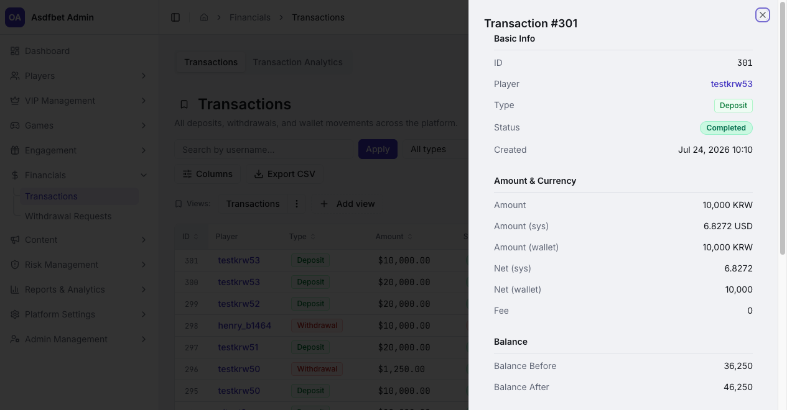
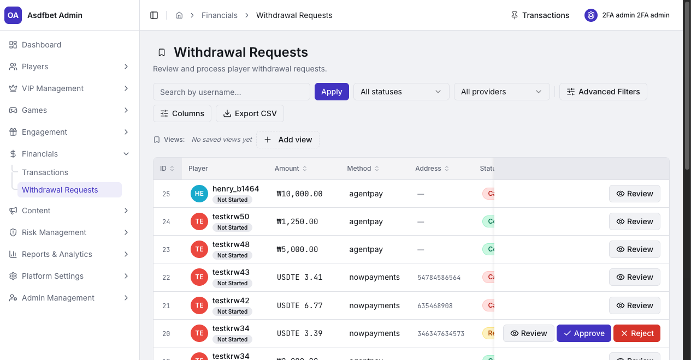
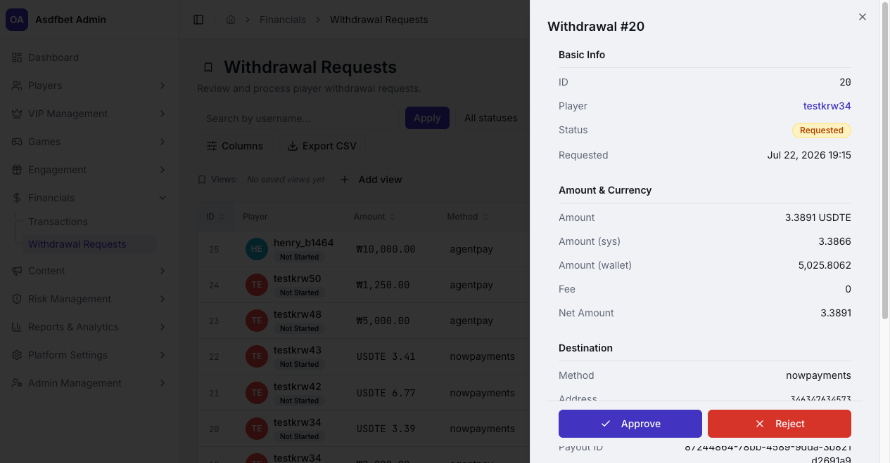

# Financials

## Financials

Use Financials for platform-wide transaction review and withdrawal decisions.

[Open the complete Financials manual](documentation.md#6-financials)

### Transactions

Search transactions by username. Filter by type, status, provider, currency, amount, or creation date.

Open a record to review system and wallet amounts, fees, payment status, and balance before and after. Export filtered results for reconciliation and audit.

Compare players across currencies using **Amount (sys)**. Wallet amounts are not directly comparable.

### Withdrawal Requests

Filter to **Requested** for the active decision queue. Open **Review** to inspect the amount, destination, provider, notes, and payout status.

Approve valid requests. Reject requests that fail checks. Use **Locked** to hold a request while an investigation continues.

Verify KYC and risk context before approving a withdrawal. Confirm the destination and review identity links for high-risk cases.

