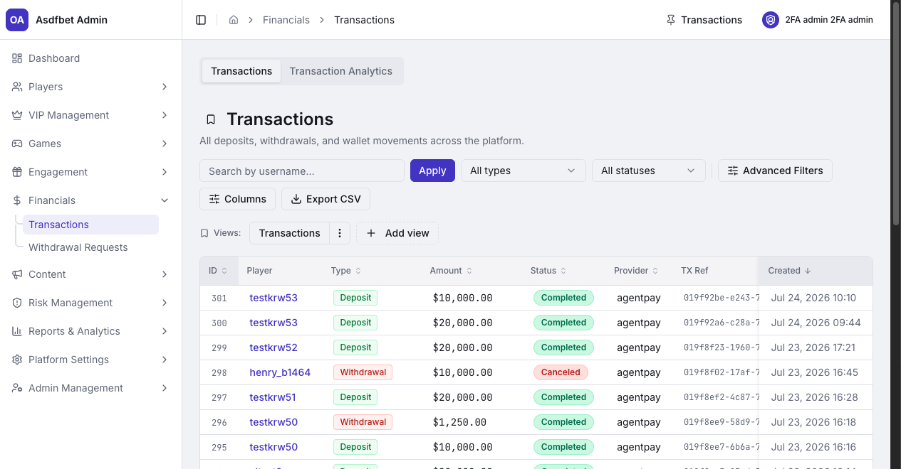

# Financials

## Financials

Use Financials for platform-wide transaction review and withdrawal decisions.

Verify KYC and risk context before approving a withdrawal.

[Read the Financials reference](documentation.md#6-financials)

[Previous: Engagement](engagement.md) · [Next: Content](content.md)
