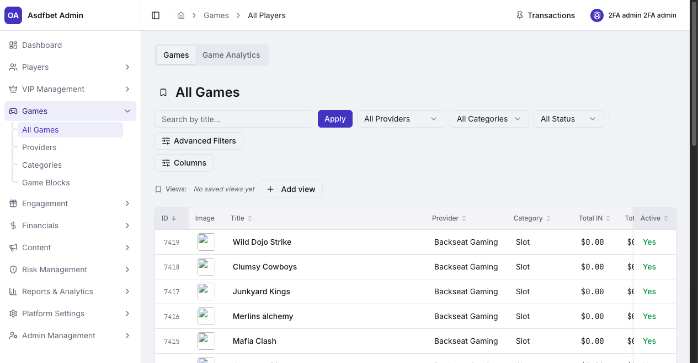
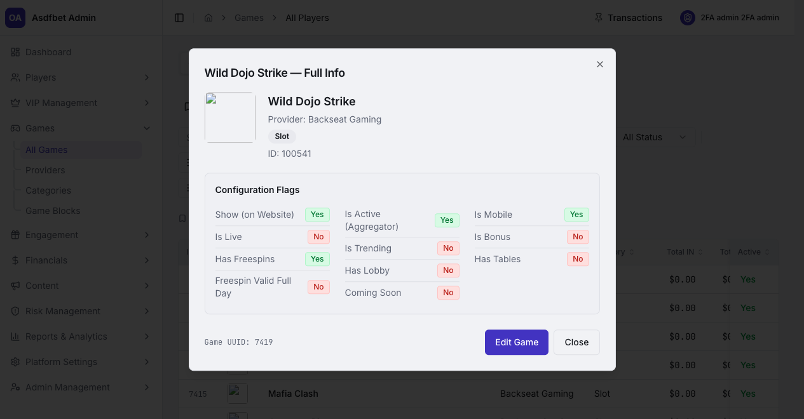
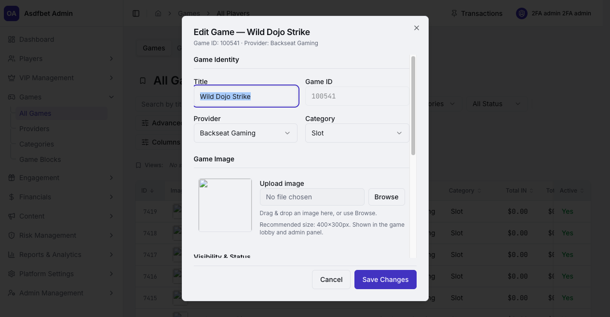
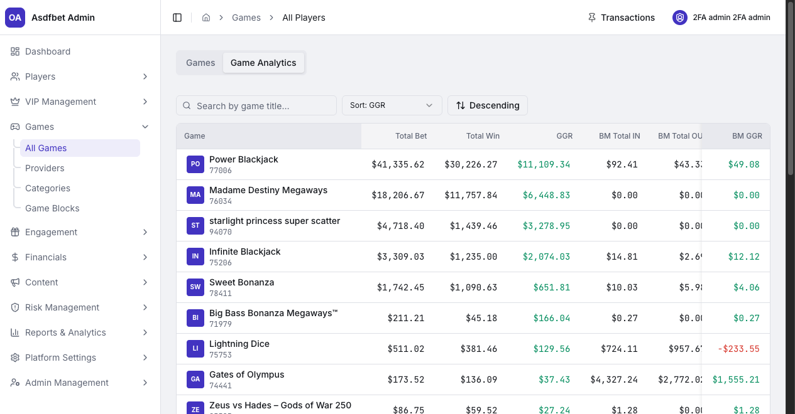
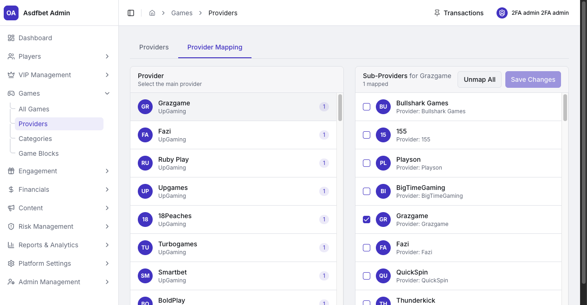
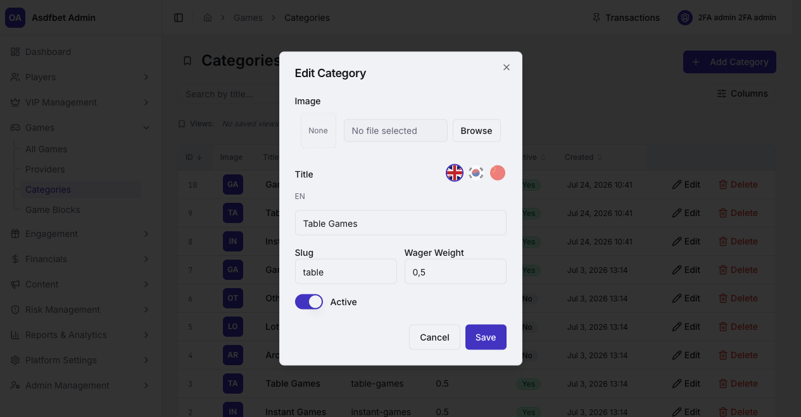
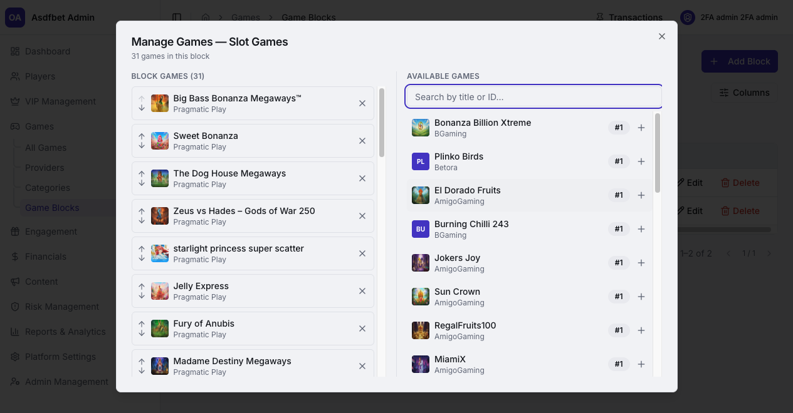

# Games

## Games

Use Games to control catalog availability and player-facing game placement.

[Open the complete Games manual](documentation.md#4-games)

### All Games

Search by title, provider, category, or status. Advanced Filters cover catalog metadata and game flags.

Use **Full Info** to inspect a game's provider data. Use **Edit Game** to change title, provider, category, thumbnail, Show, Coming Soon, Mobile, and Live settings.

**Show** controls lobby visibility. **Active** controls aggregator availability.

### Game Analytics

Sort games by GGR, Total Bet, or Total Win. Compare bonus-money metrics with real-money performance.

Use this view to identify titles that need a commercial review or improved lobby placement.

### Providers

Manage studio availability in **Providers**. Deactivating a provider disables every game under that studio.

Use **Provider Mapping** to assign sub-providers to an aggregator. Save mapping changes after updating the selection.

### Categories

Categories define the game taxonomy and each category's **Wager Weight**. The weight controls how bets contribute to bonus wagering requirements.

Review Wager Weight changes as a bonus-economics decision. They affect in-progress wagering behavior.

### Game Blocks

Game Blocks are manually ordered lobby collections. Add titles through **Manage Games**, then set their order within the block.

Use block position and active status to publish, unpublish, and order storefront sections.

[Previous: VIP Management](vip-management.md) · [Next: Engagement](engagement.md)
