# Players Management

## Players Management

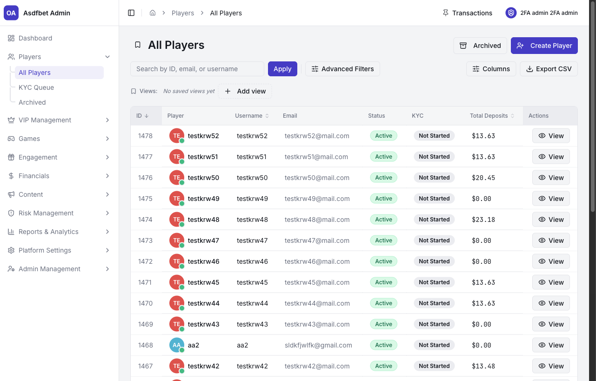

Players Management is the central hub for onboarding, account support, compliance review, security checks, and archived accounts.

### All Players

Use the primary player directory to locate and administer active accounts.

#### Search, filters, and list actions

Search by **ID**, **email**, or **username**. Advanced Filters support identity, registration, KYC, restrictions, risk groups, financial values, wagering, VIP status, and fingerprint information.

Use **Columns** to control visible fields. Save reusable filter and column sets through **Views**. Export the current filtered list to CSV.

The default table shows ID, Player, Username, Email, Status, KYC, Total Deposits, and Actions. Use **Create Player** for manual onboarding or test accounts. Use **View** to open a player profile.

#### Player profile

Each profile shows wallet currency, real balance, and bonus balance. It contains these tabs:

* **Dashboard** shows personal details, account details, action controls, and Deposit, Withdraw, Bet, Win, GGR, and bonus-balance KPIs.
* **Personal Info** contains editable profile and identity fields.
* **Transactions** contains System Transactions and Crypto Payments, plus manual **Deposit** and **Withdraw** actions.
* **Bonuses** shows bonus history and eligibility.
* **KYC** shows identity and address documents with Accept and Reject actions.
* **Notes** is the internal staff log.
* **Risk** contains Sessions, Network History, and Identity Links.
* **Notifications** shows player-facing communications.
* **Logs** is the audit trail for account and wallet actions.

Transactions include internal ID, type, system and wallet amounts, net amounts, fees, status, balances before and after, and timestamps.

Use the Dashboard action controls to manage **Can Bet**, **Can Get Bonus**, **Blocked**, **Can Deposit**, and **Can Withdraw**.

#### Account actions

Use the profile **Actions** menu to:

* Promote a player to VIP.
* Login as Player for support investigation.
* Edit details, set a password, or archive the account.

Use the secondary controls for VIP, Demo, Chat Blocked, and Chat Admin.

#### Player-support workflow

1. Find the player by ID, email, or username.
2. Check **Notes**, account status, KYC, and Risk.
3. Review the relevant profile tab before making a change.
4. Record the decision and context in **Notes**.

For balance disputes, review Transactions and balance before or after values. For suspicious activity, review Risk and Logs. For restrictions, use the relevant action control. Use Archive when the account must leave the active directory.


Always check **Notes** before acting. An existing investigation can change the correct next action.


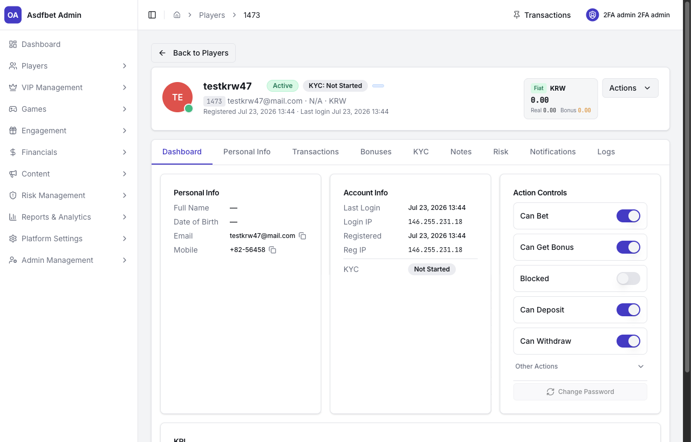

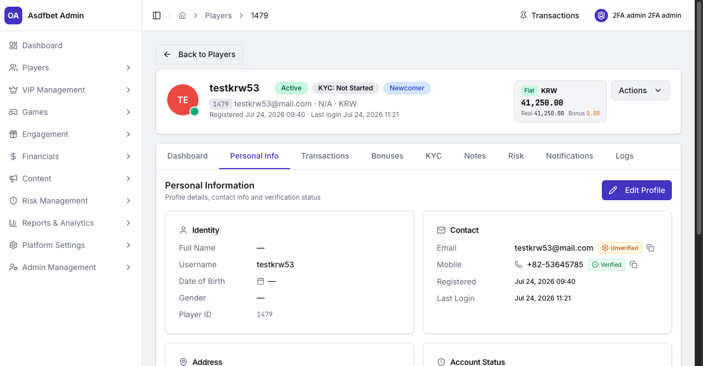

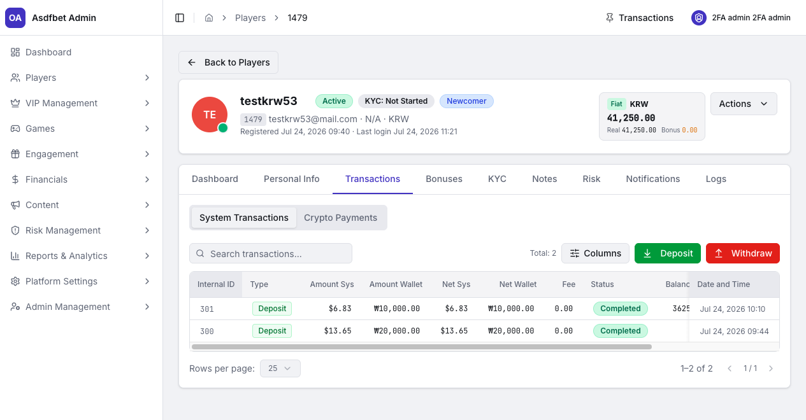

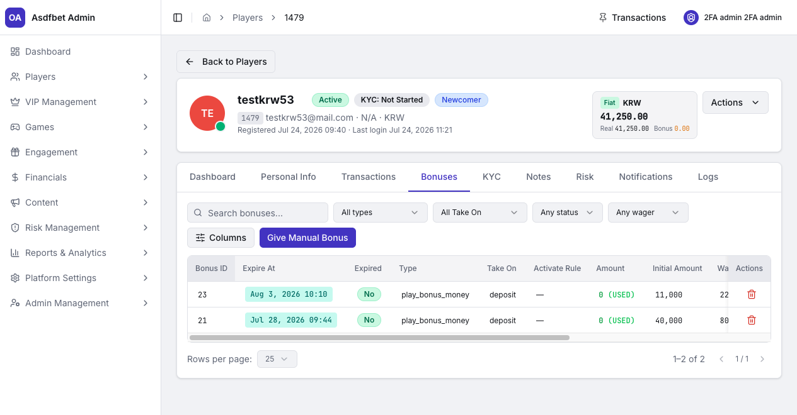

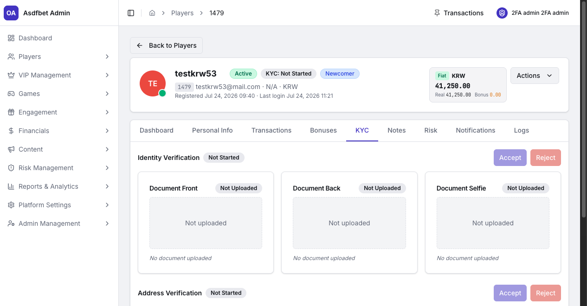

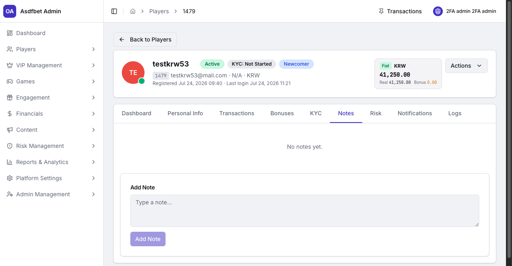

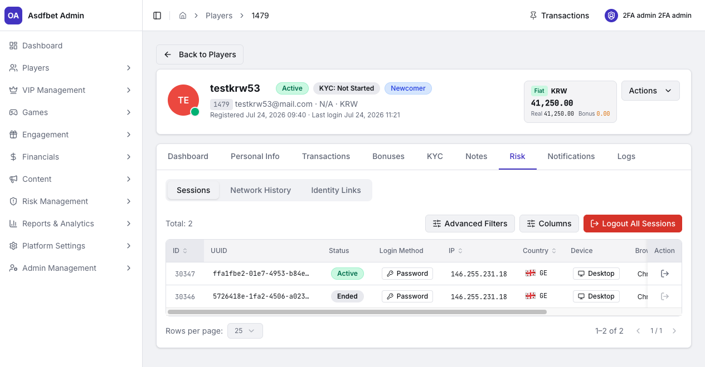

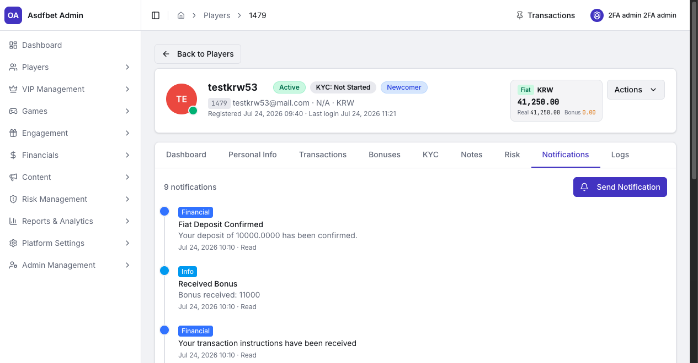

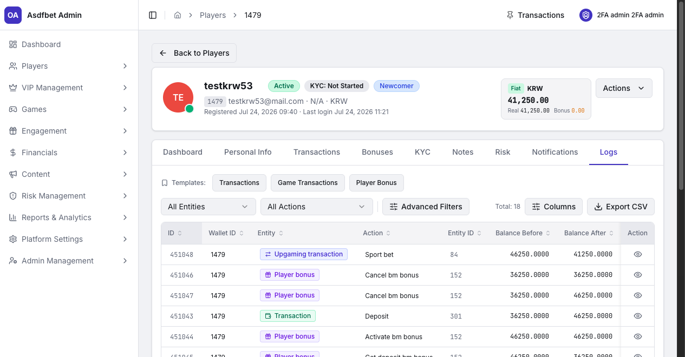

### KYC Queue

Use KYC Queue to review identity and address documents across every player. It keeps compliance work separate from the general player directory.

Filter by **Status**, **Proof Type**, and submission time. Sort by oldest or newest submission. The table shows Player, Proof Type, Submitted date, Status, and a review action.

Open a submission to review each document. Accept or reject the **Identity Verification** and **Address Verification** blocks separately. Each document can show its own uploaded state.

#### KYC workflow

1. Open the pending submission.
2. Inspect the identity, address, and supporting documents.
3. Accept or reject each verification block.
4. Confirm the updated KYC status on the profile.

Identity approval does not approve the address. Prioritize older submissions when working against compliance service-level targets.

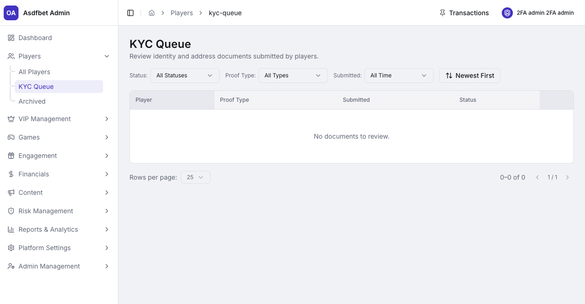

### Archived Players

Archived Players holds accounts removed from the active directory. Archiving retains identity, transactions, and audit history for compliance and support work.

Search archived accounts by ID, email, or username. Use Advanced Filters and Columns as in All Players. The list shows ID, Username, Email, Country, Archived At, and **Restore**.

#### Archive and restore workflow

1. Archive an account from its profile when it must leave active view.
2. Search Archived Players for later support, compliance, or dispute work.
3. Use **Restore** only when the account is eligible to return.

Archive is reversible and preserves records. Use it instead of deletion when retention or audit requirements apply.

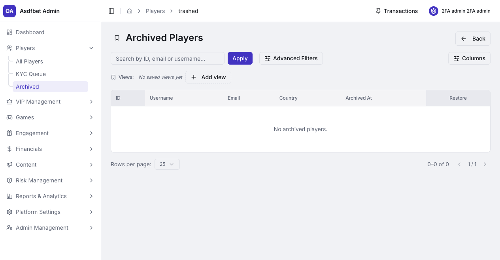

[Previous: Dashboard](dashboard.md) · [Next: VIP Management](vip-management.md)
