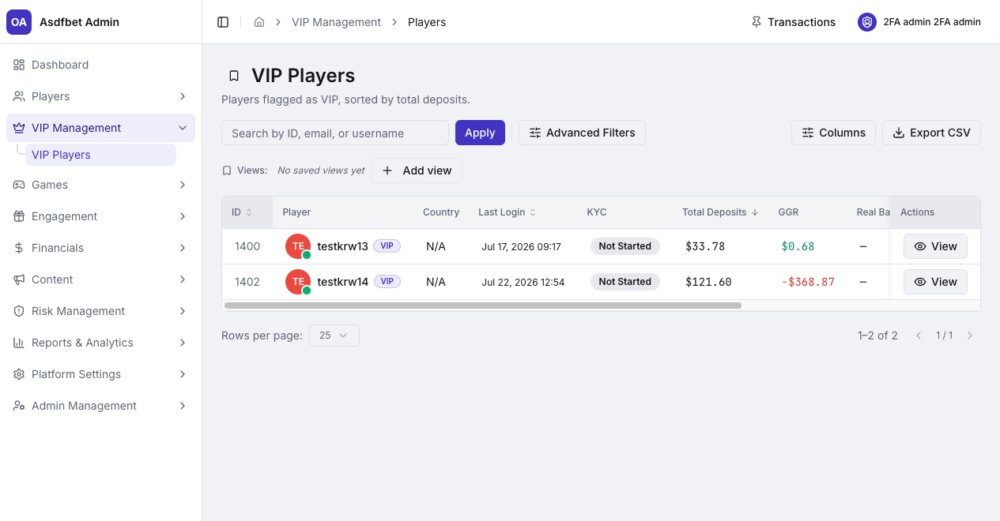
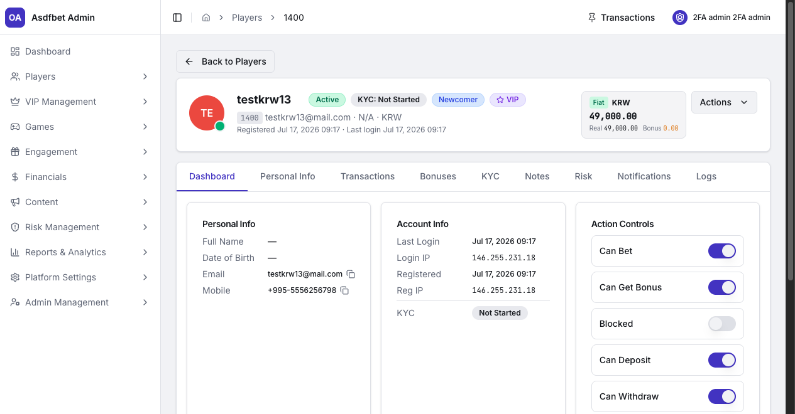

# VIP Management

## VIP Management

Use VIP Management to monitor high-value players and their account context.

[Open the complete VIP Management manual](documentation.md#3-vip-management)

### VIP Players

This directory contains VIP-flagged players. It sorts by total deposits by default.

Search by ID, email, or username. Use filters for country, KYC, and other player attributes. Export the filtered list when needed.

Open **View** to access the full player profile. Promote players from their All Players profile. This module does not create VIP records directly.

### VIP player profile

VIP profiles use the standard player-profile tabs. Review these areas before any high-value action:

* **Notes** records agreements, contact context, and previous decisions.
* **KYC** confirms identity and address verification status.
* **Risk → Identity Links** helps identify linked-account abuse.

Use Transactions to verify deposits, withdrawals, balances, and manual adjustments. Use Logs to audit staff actions. The VIP badge and rank label are separate values.

Treat large credits, bonuses, and withdrawals as risk-sensitive actions. Check context, compliance status, and account links first.

[Previous: Players Management](players-management.md) · [Next: Games](games.md)
